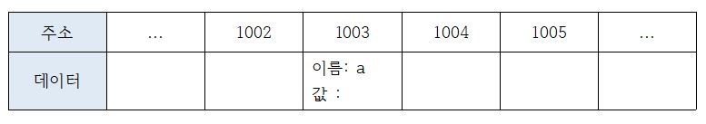

# C1 데이터 타입

1장은 데이터에 관한 장으로, 자바스크립트가 데이터를 처리하는 과정을 살펴봄으로써 기본형 타입과 참조형 타입이 서로 다르게 동작하는 이유룰 이해하고 이를 적절히 활용할 수 있게 되는 것을 목표로 합니다. 나아가 데이터 타입과 관련된 중요한 개념 몇 가지를 추가로 살펴보자.

## 01. 데이터 타입의 종류

자바스크립트의 데이터 타입에는 크게 두 가지가 있다. 기본형(원시형, primitive type)과 참조형(reference type)이다.

- 기본형에는 숫자(number), 문자(string), 불리언(boolean), null, undefined 등이 있으며, ES6에서 심볼(symbol)이 추가되었다.

- 참조형에는 객체(object), 배열(Array), 함수(function), 날짜(Date), 정규표현식(RegExp) 등과 ES6에서 Map, WeakWap, Set, WeakSet 등이 추가되었다.

그런데 어떤 기준으로 기본형과 참조형을 구분하는 것일까?

일반적으로 기본형은 할당이나 연산시 복제되고 참조형은 참조된다고 알려져 있다. 엄밀히 따지자면 둘 모두 복제를 하긴 한다. 다만 기본형은 값이 담긴 주솟값을 복제하는 반면 참조형은 값이 담긴 주솟값들로 이루어진 묶음을 가리키는 주솟값을 복제한다는 점이 다릅니다.

기본형은 불변성(immutability)을 띕니다. 언뜻 생각해보면 혼란스러울 수 있다. 기본형인 숫자 10을 담는 변수 a에 다시 숫자 15를 담으면 a의 값은 문제 없이 15로 변하는데, '변하지 않는다' 라는건 무슨 의미일까?

불변성을 잘 이해하려면 개략적으로나마 메모리와 데이터에 대한 지식이 필요하고, 나아가 '식별자'와 '변수'의 개념을 구분할 수 있어야 합니다. 지금부턴느 배경지식을 얇게 깐 다음, 메모리 영역에서 자바스크립트의 데이터가 처리되는 과정을 살펴보도록 하자.

#### 요약

- 자바스크립트의 데이터 타입에는 크게 두 가지로 기본형, 참조형으로 나뉜다.
- 기본형에는 숫자, 문자, 불리언, null, undefined, 심볼이 참조형에는 객체, 배열, 함수, 날짜, 정규표현식, Map, WeakMap, Set, WeakSet이 있다.
- 둘을 구분하는 기준은 기본형은 값이 담긴 주솟값을 복제하고 참조형은 값이 담긴 주솟값들로 이루어진 묶음을 가리키는 주솟값을 복제한다.

## 02. 데이터 타입에 관한 배경지식

### 1-2-1 메모리와 데이터

컴퓨터는 모든 데이터를 0 또는 1로 바꿔 기억한다는 사실은 익히 알고 있을 것이다. 0 또는 1만 표현할 수 있는 하나의 메모리 조각을 비트(bit)라고 한다. 메모리는 매우 많은 비트들로 구성돼 있는데, 각 비트는 고유한 식별자(unique identifier)를 통해 위치를 확인할 수 있습니다. 그런데 고작 0이나 1만 표현할 수 있는 비트 단위로 위치를 확인하는 것은 매우 비효율적입니다. 그보다는 몇 개씩 묶어 하나의 단위로 여긴다면 표현할 수 있는 값도 늘어나면서 동시에 검색 시간을 줄일 수도 있을 겁니다.

한편 매우 많은 비트를 한 단위로 묶으면 이번엔느 검색 시간을 줄일 수도 있고 표현할 수 있는 데이터의 개수도 늘어나겠지만 동시에 낭비되는 비트가 생기기도 합니다. 자주 사용하지 않을 데이터를 표현하기 위해 빈 공간을 남겨놓기보다는 표현 가능한 개수에 어느 정도 제약이 따르더라도 크게 문제가 되지 않을 적정한 공간을 묶는 편이 낫습니다. 이런 고민의 결과로 만든 바이트(byte)는 8개의 비트로 구성된 1 바이트로 총 256(2<sup>8</sup>)개의 값을 표현할 수 있습니다. 2바이트는 비트 16개이므로 65536(2<sup>16</sup>)개의 값을 표현할 수 있습니다.

C/C++, 자바 등의 정적 타입 언어는 메모리의 낭비를 최소화하기 위해 데이터 타입별로 할당할 메모리 영역을 2바이트, 4바이트 등으로 나누어 정해놓았습니다. 예를 들어, 2바이트 크기의 정수형 타입(short)은 0을 포함해 -32768 ~ +32767의 숫자만 허용합니다. 만약 사용자가 +32768 또는 그 이상의 숫자를 입력하면 오류가 나거나 잘못된 값이 저장되고 맙니다.
이 문제에 제대로 대처하기 위해서는 사용자가 직접 4바이트 크기의 정수형 타입(int) 등으로 형변환해야 합니다. 사용자 입장에서는 꽤나 번거로운 작업이지만 메모리 용량이 매우 부족했던 시절에는 불가피한 선택이었습니다.

한편 메모리 용량이 과거보다 월등히 커진 상황에서 등장한 자바스크립트는 상대적으로 메모리 관리에 대한 압박에서 자유로워졌습니다. 그래서 메모리 공간을 좀 더 넉넉하게 할당했습니다. 숫자의 경우 정수형인지 부동소수형인지를 구분하지 않고 64비트, 즉 8바이트를 확보합니다. 덕분에 개발자가 위와 같은 형변환을 걱정해야 하는 상황이 훨씬 덜 발생하게 됐습니다.

우리는 지금 컴퓨터에서 숫자형 데이터를 저장하는 방법을 개념적으로 알아보고 있습니다. 앞서 각 비트는 고유한 식별자를 지닌다고 했었죠. 바이트 역시 시작하는 비트의 식별자로 위치를 파악할 수 있을 것입니다. 모든 데이터는 바이트 단위의 식별자, 더 정확하게는 메모리 주소값(memory address)을 통해 서로 구분하고 연결할 수 있습니다.

#### 요약

- 컴퓨터는 모든 데이터를 0과 1로 바꿔 기억하고 0과 1로 표현하는 하나의 메모리 조각을 비트라고 한다.
- 각 비트는 고유한 식별자를 통해 위치를 확인할 수 있는데 0과 1로만 확인하는 것은 비효율적이다.
  - 몇 개씩 묶어 하나의 단위로 여기면 표현할 수 있는 값이 늘어나면서 검색 시간도 줄일 수 있다.
- 그렇게 생긴 것이 바이트, 8비트로 구성됨, 1바이트 256(2<sup>8</sup>), 2바이트65536(2<sup>16</sup>)개의 값으로 표현 가능
- C/C++, 자바 등의 정적 타입언어는 메모리 낭비를 최소화 하기위해 데이터 타입별로 할당할 메모리 영역을 나누어 정했다. 하지만 사용자가 해당 바이트 수 보다 큰 값을 입력하면 오류가 생긴다. -> 임의로 바꿔줘야 한다는 불편한 점이 생긴다.
- 자바스크립트는 정수형, 부동소수형 구분하지 않고 64비트, 즉 8바이트를 확보한다. -> 사용자 입장에서 편해짐.

### 1-2-2 식별자와 변수

보통 변수(varible)와 식별자(identifier)를 혼용하는 경우가 많습니다. 식별자라고 해야할곳에 변수를, 변수라고 해야할 곳에 식별자를 쓰는 식으로 말이죠. 혼용이 가능한 이유는 대부분의 경우에 문맥에 따라 무엇을 말하고자 하는지를 유추할 수 있기 때문이지만 둘의 차이를 모른다면 혼란스러울 수 있습니다.

변수는 '변할 수 있는 수' 입니다. 수학 용어를 차용했기 때문에 숫자를 의미하는 '수'가 붙었을 뿐, 값이 반드시 '숫자'여야 하는 것은 아닙니다. 영어 단어 variable은 원래 '변할 수 있다' 라는 형용사이지만 컴퓨터 용어로 쓸 때는 '변할 수 있는 무언가' 라는 명사로 확장시켰습니다. 여기서 '무언가' 란 데이터를 말합니다. 숫자도 데이터이고, 문자열, 객체, 배열 모두 데이터입니다. 식별자는 어떤 데이터를 식별하는 데 사용하는 이름, 즉 변수명입니다.

#### 요약

- 변수와 식별자를 혼용하는 경우가 많다.
- 변수는 '변할 수 있는 수'이다.
- '수'는 모든 데이터를 말한다.
- 식별자는 어떤 데이터를 식별하는 데 사용하는 이름, 즉 '변수명'이다.

## 03 변수 선언과 데이터 할당

### 1-3-1 변수 선언

변수를 선언하는 방법은 이미 알고 있기에 방법이 아닌 동작 원리에 대해 알아보자.

우선 기본적인 변수 선언식을 예로 들어 살펴보자.

```js
var a;
```

위의 선언식을 말로 풀어쓰면 "변할 수 있는 데이터를 만든다. 이 데이터의 식별자를 a로 한다"가 된다.
변할 수 있는 데이터이니 선언할 때는 undefined이더라도 나중에 다른 값으로 바꾸면 된다. 이렇게 보면 변수란 결국 변경 가능한 데이터가 담길 수 있는 공간 또는 그릇이라고 생각할 수 있다. 이 공간에 숫자를 담았다가 문자열을 담는 등의 다양한 명령을 내릴 수 있다.

이를 바탕으로 컴퓨터가 위의 식의 명령을 받아 메모리 영역에서 어떤 작업을 수행하는 지를 표로 표현해보자. 실제 메모리 구조를 그대로 그리는 것이 아니라 '자바스크립트의 데이터 구조 이해' 달성을 위해 개략적으로 표현해보자.

<caption>1-3</caption>


위의 변수 선언식의 명령을 받은 컴퓨터는 메모리에서 비어있는 공간 하나를 확보한다. 1-3에서는 임의로 1003번으로 정했다. 이 공간의 이름(식별자)을 a라고 지정한다. 여기까지가 변수 선언과정이다. 이후에 사용자가 a에 접근하고자 하면 컴퓨터는 메모리에서 a라는 이름을 가진 주소를 검색해 해당 공간에 담긴 데이터를 반환할 것이다.
