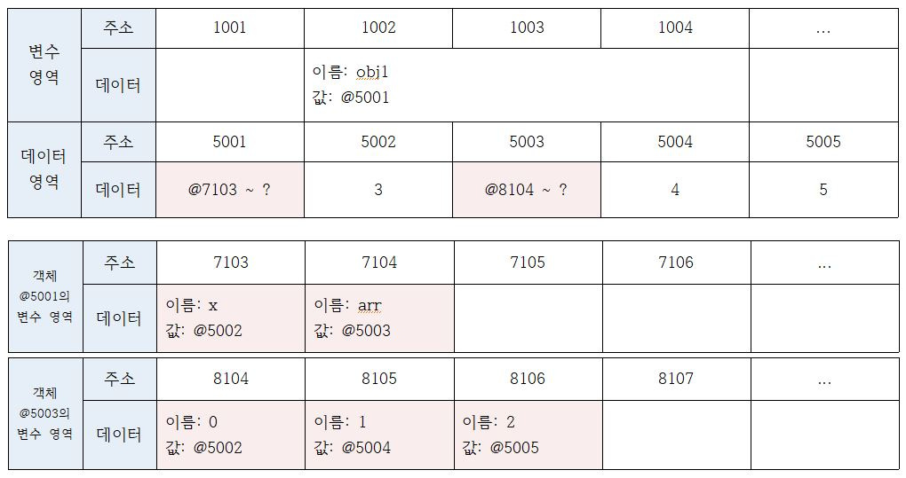

# C1 데이터 타입

- 목표
  - 데이터에 관한 장으로, 자바스크립트가 데이터를 처리하는 과정을 살펴봄으로써 기본형 타입과 참조형 타입이 서로 다르게 동작하는 이유룰 이해하고 이를 적절히 활용할 수 있게 되는 것이 목표.
  - 나아가 데이터 타입과 관련된 중요한 개념 몇 가지를 추가로 살펴보자.

# 1.0 데이터 타입의 종류

자바스크립트의 데이터 타입에는 크게 두 가지가 있다.

- 기본형(원시형, primitive type)
  - 숫자(number), 문자(string), 불리언(boolean), null, undefined 등이 있으며, ES6에서 심볼(symbol)이 추가되었다.
- 참조형(reference type)
  - 참조형에는 객체(object), 배열(Array), 함수(function), 날짜(Date), 정규표현식(RegExp) 등과 ES6에서 Map, WeakWap, Set, WeakSet 등이 추가되었다.

## 1.1 그런데 어떤 기준으로 기본형과 참조형을 구분하는 것일까?

- 일반적으로 기본형은 할당이나 연산시 `복제`되고 참조형은 `참조`된다고 알려져 있다.
- 엄밀히 따지자면 `둘 모두 복제`를 하긴 한다.
- 다만 기본형은 값이 담긴 `주솟값을 복제`하는 반면 `참조형`은 값이 담긴 주솟값들로 이루어진 `묶음`을 가리키는` 주솟값을 복제`한다는 점이 다릅니다.

> 🤔 기본형은 불변성(immutability). 언뜻 생각해보면 혼란스러울 수 있다.
>
> - 기본형인 숫자 10을 담는 변수 a에 다시 숫자 15를 담으면 a의 값은 문제 없이 15로 변하는데, '변하지 않는다' 라는건 무슨 의미일까?

- 불변성을 잘 이해하려면 개략적으로나마 메모리와 데이터에 대한 지식이 필요하고, 나아가 '식별자'와 '변수'의 개념을 구분할 수 있어야 한다.
- 지금부턴 배경지식을 얇게 깐 다음, 메모리 영역에서 자바스크립트의 데이터가 처리되는 과정을 살펴보도록 하자.

#### 📕 요약

- 자바스크립트의 데이터 타입에는 크게 두 가지로 기본형, 참조형으로 나뉜다.
- 기본형에는 숫자, 문자, 불리언, null, undefined, 심볼이 참조형에는 객체, 배열, 함수, 날짜, 정규표현식, Map, WeakMap, Set, WeakSet이 있다.
- 둘을 구분하는 기준은 기본형은 값이 담긴 주솟값을 복제하고 참조형은 값이 담긴 주솟값들로 이루어진 묶음을 가리키는 주솟값을 복제한다.

# 1.2 데이터 타입에 관한 배경지식

## 1.2.1 메모리와 데이터

- 컴퓨터는 모든 데이터를 0 또는 1로 바꿔 이해한다.
- 0 또는 1만 표현할 수 있는 하나의 메모리 조각을 비트(bit)라고 한다.
- 각 비트는 고유한 식별자(unique identifier)를 통해 위치를 확인할 수 있다.
- 고작 0이나 1만 표현할 수 있는 비트 단위로 위치를 확인하는 것은 매우 비효율적이다.
- 몇 개씩 묶어 하나의 단위로 여긴다면 표현할 수 있는 값도 늘어나면서 동시에 검색 시간을 줄일 수도 있을 겁니다.

- 매우 많은 비트를 한 단위로 묶으면 검색 시간을 줄일 수도 있고 표현할 수 있는 데이터의 개수도 늘어나겠지만 동시에 낭비되는 비트가 생기기도 한다.
- 자주 사용하지 않을 데이터를 표현하기 위해 빈 공간을 남겨놓기보다는 표현 가능한 개수에 어느 정도 제약이 따르더라도 크게 문제가 되지 않을 적정한 공간을 묶는 편이 낫다.
  - 이런 고민의 결과로 만든 바이트(byte)는 8개의 비트로 구성된 1 바이트로 총 256(2<sup>8</sup>)개의 값을 표현할 수 있다.
  - 2바이트는 비트 16개이므로 65536(2<sup>16</sup>)개의 값을 표현할 수 있다.

### 옛날 옛적엔

- C/C++, 자바 등의 정적 타입 언어는 메모리의 낭비를 최소화하기 위해 데이터 타입별로 할당할 메모리 영역을 2바이트, 4바이트 등으로 나누어 정해놓았다.
  - 예를 들어, 2바이트 크기의 정수형 타입(short)은 0을 포함해 -32768 ~ +32767의 숫자만 허용한다. 만약 사용자가 +32768 또는 그 이상의 숫자를 입력하면 오류가 나거나 잘못된 값이 저장된다.
- 이 문제에 제대로 대처하기 위해서는 사용자가 직접 4바이트 크기의 정수형 타입(int) 등으로 형변환해야한다.
- 사용자 입장에서는 꽤나 번거로운 작업이지만 메모리 용량이 매우 부족했던 시절에는 불가피한 선택이었다.

### 현재는

한편 메모리 용량이 과거보다 월등히 커진 상황에서 등장한 자바스크립트는 상대적으로 메모리 관리에 대한 압박에서 자유로워졌다. 그래서 메모리 공간을 좀 더 넉넉하게 할당했다.

- 숫자의 경우 정수형인지 부동소수형인지를 구분하지 않고 64비트, 즉 8바이트를 확보한다.
- 덕분에 개발자가 위와 같은 형변환을 걱정해야 하는 상황이 훨씬 덜 발생하게 됐다.

컴퓨터에서 숫자형 데이터를 저장하는 방법을 개념적으로 알아보았다.
앞서 각 비트는 고유한 식별자를 지닌다고 했었다.
바이트 역시 시작하는 비트의 식별자로 위치를 파악할 수 있을 것이다.
모든 데이터는 바이트 단위의 `식별자`, 더 정확하게는` 메모리 주소값(memory address)`을 통해 서로 구분하고 연결할 수 있다.

#### 요약

- 컴퓨터는 모든 데이터를 0과 1로 바꿔 기억하고 0과 1로 표현하는 하나의 메모리 조각을 비트라고 한다.
- 각 비트는 고유한 식별자를 통해 위치를 확인할 수 있는데 0과 1로만 확인하는 것은 비효율적이다.
  - 몇 개씩 묶어 하나의 단위로 여기면 표현할 수 있는 값이 늘어나면서 검색 시간도 줄일 수 있다.
- 그렇게 생긴 것이 바이트, 8비트로 구성됨, 1바이트 256(2<sup>8</sup>), 2바이트65536(2<sup>16</sup>)개의 값으로 표현 가능
- C/C++, 자바 등의 정적 타입언어는 메모리 낭비를 최소화 하기위해 데이터 타입별로 할당할 메모리 영역을 나누어 정했다. 하지만 사용자가 해당 바이트 수 보다 큰 값을 입력하면 오류가 생긴다. -> 임의로 바꿔줘야 한다는 불편한 점이 생긴다.
- 자바스크립트는 정수형, 부동소수형 구분하지 않고 64비트, 즉 8바이트를 확보한다. -> 사용자 입장에서 편해짐.

## 1.2.2 식별자와 변수

- 보통 변수(varible)와 식별자(identifier)를 혼용하는 경우가 많다.
- 식별자라고 해야할곳에 변수를, 변수라고 해야할 곳에 식별자를 쓰는 식으로 말이다.
- 혼용이 가능한 이유는 대부분의 경우에 문맥에 따라 무엇을 말하고자 하는지를 유추할 수 있기 때문이지만 둘의 차이를 모른다면 혼란스러울 수 있다.

- 변수는 `'변할 수 있는 수'` 로, 수학 용어를 차용했기 때문에 숫자를 의미하는 '수'가 붙었을 뿐, 값이 반드시 '숫자'여야 하는 것은 아니다.
- 영어 단어 variable은 원래 '변할 수 있다' 라는 형용사이지만 컴퓨터 용어로 쓸 때는 '변할 수 있는 무언가' 라는 명사로 확장시켰다.
- 여기서 '무언가' 란 데이터를 말한다. 숫자도 데이터이고, 문자열, 객체, 배열 모두 데이터이다.
- 식별자는 어떤 데이터를 식별하는 데 사용하는 이름, 즉 `변수명`입니다.

#### 요약

- 변수와 식별자를 혼용하는 경우가 많다.
- 변수는 '변할 수 있는 수'이다.
- '수'는 모든 데이터를 말한다.
- 식별자 = `'변수명'`이다.

# 1.3 변수 선언과 데이터 할당

## 1.3.1 변수 선언

변수를 선언하는 방법은 이미 알고 있기에 방법이 아닌 동작 원리에 대해 알아보자.

우선 기본적인 변수 선언식을 예로 들어 살펴보자.

```js
var a;
```

- 위의 선언식을 말로 풀어쓰면 `"var -> 변할 수 있는 데이터를 만든다. 이 데이터의 식별자를 a로 한다"`가 된다.
- 변할 수 있는 데이터이니 선언할 때는 undefined이더라도 나중에 다른 값으로 바꾸면 된다.
- 변수란 변경 가능한 데이터가 담길 수 있는 `공간 또는 그릇`이라고 비유할 수 있다.
- 이 공간에 숫자를 담았다가 문자열을 담는 등의 다양한 명령을 내릴 수 있다.

이를 바탕으로 컴퓨터가 위의 식의 명령을 받아 메모리 영역에서 어떤 작업을 수행하는 지를 표로 표현해보자. 실제 메모리 구조를 그대로 그리는 것이 아니라 '자바스크립트의 데이터 구조 이해' 달성을 위해 개략적으로 표현해보자.

### 예제


1. 위의 변수 선언식의 명령을 받은 컴퓨터는 메모리에서 비어있는 공간 하나를 확보한다.
2. 1-3에서는 임의로 1003번으로 정했다.
3. 이 공간의 이름(식별자)을 a라고 지정한다. 여기까지가 변수 선언과정이다.
4. 이후에 사용자가 a에 접근하고자 하면 컴퓨터는 메모리에서 a라는 이름을 가진 주소를 검색해 해당 공간에 담긴 데이터를 반환할 것이다.

### 1.3.2 데이터 할당

```js
var a; //변수 a 선언
a = "abc"; // 변수 a에 데이터 할당

var a = "abc"; // 변수 선언과 할당을 한 문장으로 표현
```

- 선언과 할당을 위의 식과 같이 두 문장으로 나누어 명령하든 한 문장으로 연결하든, 자바스크립트 엔진은 결국 같은 동작을 수행한다.
- 메모리에서 비어있는 공간을 확보하고 그 공간의 이름을 설정하는 선언과정은 앞서 살펴본 것과 같다.

이어서 할당 과정이다. a라는 이름을 가진 주소를 검색해서 그곳에 문자열 'abc'를 할당하면 될 것이다.

그런데 실제로는 해당 위치에 문자열 'abc'를 직접 저장하지는 않는다.

데이터를 저장하기 위한 별도의 메모리 공간을 다시 확보해서 문자열 'abc'를 저장하고, 그 주소를 변수 영역에 저장하는 식으로 이뤄진다.

이제부터는 데이터의 성질에 따라 `'변수 영역', '데이터 영역'`으로 구분하여 살펴보자.

데이터 할당의 전체 흐름은 다음과 같다. 그림 1-4와 함께 순서대로 따라가 보자.

### 예제


1. 변수 영역에서 빈 공간(@1003)을 확보한다.
2. 확보한 공간의 식별자를 a로 지정한다.
3. 데이터 영역의 빈 공간(@5004)에 문자열 'abc'를 저장한다.
4. 변수 영역에서 a라는 식별자를 검색한다(@1003).
5. 앞서 저장한 문자열의 주소(@5004)를 @1003의 공간에 대입한다.

> #### 🤔 왜 변수 영역에 값을 직접 대입하지 않고 굳이 번거롭게 한 단계를 더 거치는 걸까?
>
> 이는 데이터 변환을 자유롭게 할 수 있게 함과 동시에 메모리를 더욱 효율적으로 관리하기 위한 고민의 결과이다. 1.2.1 절에서 자바스크립트는 숫자형 데이터에 대해 64비트의 공간을 확보한다고 했다. 반면 문자열은 특별히 정해진 규격이 없다. 한 글자마다 영어는 1바이트, 한글은 2바이트 등으로 각각 필요한 메모리 용량이 가변적이며 전체 글자 수 역시 가변적이기 때문이다.

만약 미리 확보한 공간 내에서만 데이터 변환을 할 수 있다면 변환한 데이터를 다시 저장하기 위해서는 `'확보된 공간을 변환된 데이터 크기에 맞게 늘리는 작업'`이 선행돼야 할 것이다.

> #### 🤔 해당 공간이 메모리 상의 가장 마지막에 있었다면 뒤쪽으로 늘리기만 하면 되니까 어렵지 않겠지만 중간에 있는 데이터를 늘려야 하는 상황이라면 어떨까?
>
> 해당 공간보다 뒤에 저장된 데이터들을 전부 뒤로 옮기고, 이동시킨 주소를 각 식별자에 다시 연결하는 작업을 해야한다. 컴퓨터가 처리해야 할 연산이 많아질 수 밖에 없다. 결국 `효율적`으로 문자열 데이터의 반환을 처리하려면 변수와 데이터를 별도의 공간에 나누어 저장하는 것이 최적이다.

### 예제

```js
var a = "abc";
var a = "abcdef";
```

문자열 'abc'의 마지막에 'def'를 추가하려고 하면 컴퓨터는 앞서 'abc'가 저장된 공간에 'abcdef'를 할당하는 대신 'abcdef'라는 문자열을 새로 만들어 별도의 공간에 저장하고, 그 주소를 변수 공간에 연결한다. 반대로 'abc'의 마지막 'c'를 제거하하고 해도 새로만든다. 기존 문자열에 어떤 변환을 가하든 상관없이 무조건 새로 만들어 별도의 공간에 저장한다.


다른 예로 500개의 변수를 생성해서 모든 변수에 숫자 5를 할당하는 상황을 생각해보자. 각 변수를 별개로 인식하려면 500개의 변수 공간을 확보하는 것은 불가피하다. 그런데 각 변수 공간마다 매번 숫자 5를 할당하려고 하면 숫자형은 8바이트가 필요하다고 했으니 총 4000(500 \_ 8)바이트를 써야 할 것이다.

> #### 🤔 그 대신 5를 별도의 공간에 한 번만 저장하고 해당 주소만 입력한다면 어떨까?
>
> 예를 들어, 주소 공간의 크기가 2바이트라고 한다면 1008(500 \_ 2 + 8)바이트만 이용하면 된다. 이처럼 변수 영역과 데이터 영역을 분리하면 중복된 데이터에 대한 처리 효율이 높아진다.

# 1.4 기본형 데이터와 참조형 데이터

## 1.4.1 불변값

- 변수(variable)와 상수(constant)를 구분하는 성질은 `'변경 가능성'`이다.
- 바꿀 수 있으면 `변수`, 바꿀 수 없으면 `상수`이다.
- 불변값과 상수를 같은 개념으로 오해하기 쉬운데, 이 둘을 명확하게 구분할 필요가 있다.
- 변수와 상수를 구분 짓는 변경 가능성의 대상은`"변수 영역 메모리"`이다.
- 한 번 데이터 할당이 이루어진 변수 공간에 다른 데이터를 `재할당`할 수 있는지 여부가 관건이다.
- 반면 불변성 여부를 구분할 때의 변경 가능성의 대상은 `"데이터 영역 메모리"`이다.

### 예제

기본형 데이터인 숫자, 문자열, boolean, undefined, symbol은 모두 불변값이다. 그 중 숫자와 문자열을 예로 들어 불변성의 개념을 알아보자.

```js
var a = "abc";
a = a + "def";

var b = 5;
var c = 5;
b = 7;
```

우선 위 코드의 1 ~ 2번째 줄을 보자.

변수 a에 문자열 'abc'를 할당했다가 뒤에 'def'를 추가하면 기존의 'abc'가 'abcdef'로 바뀌는 것이 아니라 새로운 문자열 'abcdef'를 만들어 그 주소를 변수 a에 저장한다.

'abc'와 'abcdef'는 완전히 별개의 데이터이다.

4번째 줄에서는 변수 b에 숫자 5를 할당한다.

그러면 컴퓨터는 일단 데이터 영역에서 5를 찾고, 없으면 그제서야 데이터 공간을 하나 만들어 저장한다.

그 주소를 b에 저장한다.

5번째 줄에서는 다시 같은 수 수인 5를 할당하려고 한다.

컴퓨터에는 데이터 영역에서 5를 찾는다. 4번째 줄에서 이미 만들어 놓은 값이 있으니 그 주소를 재활용한다.

6번째 줄에서는 변수 b의 값을 7로 바꾸고자 한다.

그러면 기존에 저장된 5 자체를 7로 바꾸는 것이 아니라 기존에 저장했던 7을 찾아서 있으면 재활용하고 없으면 새로 만들어 b에 저장한다.

결국 5와 7 모두 다른 값으면 변경할 수 없다.

이처럼 문자열 값도 한 번 만든 값을 바꿀 수 없고, 숫자 값도 다른 값으로 변경할 수 없다. 변경은 새로 만드는 동작을 통해서만 이뤄진다.
이것이 바로 `불변값의 성질`이다. 한 번 만들어진 값은 `가비지 컬렉팅`을 당하지 않는 한 영원히 변하지 않는다.

> #### 💡 가비지 컬렉팅이란?
>
> 주로 컴퓨터 프로그래밍에서 사용되는 용어로, 프로그램 실행 중에 사용되지 않는 메모리나 자원들을 정리하고 회수하는 작업을 나타낸다. <br>
> 이는 프로그램의 성능과 자원 관리에 중요한 역할을 한다.

## 1.4.2 가변값

- 기본형 데이터는 모두 불변값이라고 했다.
- 그렇다면 참조형 데이터는 모두 가변값일 것같은 느낌이 들것이다.
- 기본적인 성질은 가변값인 경우가 많지만 설정에 따라 변경 불가능한 경우(Object, defineProperty, Object.freeze 등)도 있고, 아예 불변값으로 활용하는 방안도 있다.

### 1.4.2.1 참조형 데이터의 할당 예제

```js
var obj1 = {
  a: 1,
  b: "bbb",
};
```


1. 컴퓨터는 우선 변수 영역의 빈 공간(@1002)을 확보하고, 그 주소의 이름을 obj1로 지정한다.
2. 임의의 데이터 저장 공간(@5001)에 데이터를 저장하려고 보니 여러 개의 프로퍼티로 이뤄진 데이터 그룹이다. 이 그룹 내부의 프로퍼티들을 저장하기 위해 별도의 변수 영역을 마련하고, 그 영역의 주소(@7103 ~ ?)을 @5001에 저장한다.(객체의 프로퍼티들을 저장하기 위한 메모리 영역은 크기가 정해져 있지 않고 필요한 시점에 동적으로 확보한다.)
3. @7103 및 @7104에 각각 a와 b라는 프로퍼티 이름을 지정한다.
4. 데이터 영역에서 숫자 1을 검색한다. 검색 결과가 없으므로 임의로 @5003에 저장하고, 이 주소를 @7103에 저장한다. 문자열 'bbb' 역시 임의로 @5004에 저장하고, 이 주소를 @7104에 저장한다.

기본형 데이터와의 차이는 '객체의 변수(프로퍼티) 영역'이 별도로 존재한다는 점이다.

그림을 자세히 보면 객체가 별도로 할애한 영역은 변수 영역일 뿐 '데이터 영역'은 기존의 메모리 공간을 그대로 활용하고 있다.

데이터 영역에 저장된 값은 모두 불변값이다. 그러나 변수에는 다른 값을 얼마든지 대입할 수 있다.

바로 이부분 때문에 흔히 참조형 데이터는 불변(immutable)하지 않다(가변값이다)라고 하는 것이다.

### 1.4.2.2 참조형 데이터의 프로퍼티 재할당 예제

```js
var obj1 = {
  a: 1,
  b: "bbb",
};
obj1.a = 2;
```

obj1의 a 프로퍼티에 숫자 2를 할당하려고 한다.

데이터 영역에서 숫자 2를 검색한다.

검색 결과가 없으므로 빈 공간인 @5005에 저장하고, 이 주소를 @7103에 저장한다.

4번째 줄의 명령 전과 후에 변수 obj1이 바라보고 있는 주소는 @5001로 변하지 않았다.

즉 '새로운 객체'가 만들어진 것이 아니라 기존의 객체 내부의 값만 바뀐 것이다.


이번에는 참조형 데이터의 프로퍼티에 다시 참조형 데이터를 할당하는 경우를 살펴보자.

참고로 이런 경우를 `중첩 객체(nested object)`라고 한다.

### 1.4.2.3 중첩된 참조형 데이터(객체)의 프로퍼티 할당 예제

```js
var obj = {
  x: 3,
  arr: [3, 4, 5],
};
```

1. 컴퓨터는 우선 변수 영역의 빈 공간(@1002)을 확보하고, 그 주소의 이름을 obj로 지장한다.
2. 임의의 데이터 저장공간(@5001)에 데이터를 저장하려는데, 이 데이터는 여러 개의 변수와 값들을 모아놓은 그룹(객체)이다. 이 그룹의 각 변수(프로퍼티)들을 저장하기 위해 별도의 변수 영역을 마련하고(@7103 ~ ?), 그 영역의 주소를 @5001에 저장한다.
3. @7103에 이름 x를, @7104에 이름 arr를 지정한다.
4. 데이터 영역에서 숫자 3을 검색한다. 없으므로 임의로 @5002에 저장하고, 이 주소를 @7103에 저장한다.
5. @7104에 저장할 값은 배열로서 역시 데이터 그룹이다. 이 그룹 내부의 프로퍼티들을 저장하기 위해 별도의 변수 영역을 마련하고(@8104 ~ ?), 그 영역의 주소 정보(@8104 ~ ?)를 @5003에 저장한 다음, @5003을 @7104에 저장한다.
6. 배열의 요소가 총 3개이므로 3개의 변수 공간을 확보하고 각각 인덱스를 부여한다.(0,1,2)
7. 데이터 영역에서 숫자 3을 검색해서(@5002) 그 주소를 @8104에 저장한다.
8. 데이터 영역에서 숫자 4가 없으므로 @5004에 저장하고, 이 주소를 @8105에 저장한다.
9. 데이터 영역에 숫자 5가 없으므로, @5005에 저장하고, 이 주소를 @8106에 저장한다.



이제 obj.arr[1]을 검색하고자 하면 메모리에서는 다음과 같은 검색 과정을 거친다.

1. obj 검색 1: obj라는 식별자를 가진 주소를 찾는다(@1002)
2. obj 검색 2: 값이 주소이므로 그 주소로 이동한다(@5001)
3. obj 검색 3: 값이 주소이므로 그 주소로 이동한다(@7103 ~ ?)
4. obj.arr 검색 1: arr이라는 식별자를 가진 주소를 찾는다(@7104)
5. obj.arr 검색 2: 값이 주소이므로 그 주소로 이동한다(@5003)
6. obj.arr 검색 3: 값이 주소이므로 그 주소로 이동한다(@8104 ~ ?)
7. obj.arr[1] 검색 1: 인덱스 1에 해당하는 주소를 찾는다(@8105)
8. obj.arr[1] 검색 2: 값이 주소이므로 그 주소로 이동한다(@5004)
9. obj.arr[1] 검색 3: 값이 숫자형 데이터이므로 4를 반환한다.

```
@1002 -> @5001 -> (@7103~?) -> @7104 -> @5003 -> (@8104~?) -> @8105 -> @5004 -> 4반환
```

> ### 🤔 만약 이 상태에서 다음과 같이 재할당 명령을 내리면 어떻게 될까?

```js
obj.arr = "str";
```

@5006에 문자열 'str'을 저장하고, 그 주소를 @7104에 저장한다.

그러면 @5003은 더이상 자신의 주소를 참조하는 변수가 하나도 없게 된다.

어떤 데이터에 대해 자신의 주소를 참조하는 변수의 개수를 참조 카운트라고 한다.

@5003의 참조 카운트는 @7104에 @5003이 저장돼 있던 시점까지는 1이었다가 @7104에 @5006이 저장되는 순간 0이 된다.

참조 카운트가 0인 메모리 주소는 가비지 컬렉터(garbage collector, GC)의 수거 대상이 된다.

가비지 컬렉터는 런타임 환경에 따라 특정 시점이나 메모리 사용량이 포화 상태에 임박할 때마다 자동으로 수거 대상들을 수거(collecting)한다.

수거된 메모리는 다시 새로운 값을 할당할 수 있는 빈 공간이 된다.

즉, @5003은 참조 카운트가 0이 됨에 따라 GC 대상이 되고, 이후 언젠가 담겨 있던 데이터인 "@8104~?"라는 값이 사라진다.

이 과정에서 연쇄적으로 @8104~?의 각 데이터들의 참조 카운트가 0이 되고, 이들 역시 GC의 대상이 되어 함께 사라질 것이다.

### 중첩된 참조형 데이터(객체)의 프로퍼티 재할당 예제


## 1.4.3 변수 복사 비교

동작 방식을 알았으니 이제 본격적으로 기본형 데이터와 참조형 데이터의 차이를 확인해볼 차례이다. 먼저 변수를 복사할 때의 변화를 살펴보자.

#### 변수 복사

```js
var a = 10;
var b = a;

var obj1 = { c: 10, d: "ddd" };
var obj2 = obj1;
```

우선 기본형 데이터부터 살펴보자.

1번째 줄에서는 변수 영역의 빈 공간 @1001을 확보하고 식별자 a로 지정한다.

숫자 10을 데이터 영역에서 검색하고 없으므로 빈 공간 @5001에 저장한 다음, 이 주소를 @1001에 넣었다.

이로써 기본형 데이터에 대한 변수 선언 및 할당이 종료된다.

이제 복사를 할 차례이다.

변수 영역의 빈 공간 @1002을 확보하고 식별자를 b로 지정한다.

이제 식별자 a를 검색해 그 값을 찾아와야 한다. @1001에 저장된 값인 @5001을 들고 좀 전에 확보해둔 @1002에 값으로 대입힌다.

다음으로 참조형 데이터를 보자.

4번째 줄에서는 변수 영역의 빈 공간 @1003를 확보해 식별자 obj1로 지정한다.

데이터 영역의 빈 공간 @5002을 확보하고, 데이터 그룹이 담겨야 하기 때문에 별도의 변수 영역 @7103~을 확보해 그 주소를 저장한다.

@7103에는 식별자 c를, @7104에는 식별자 b를 입력한 다름, c에 대입할 값 10을 데이터 영역에서 검색한다.

@5001에 이미 저장돼 있으므로 이 주소를 @7103에 연결하고, 문자열인 'ddd'는 데이터 영역의 빈 공간에 새로 만들어서 @7104에 연결한다. 여기까지가 참조형 데이터인 객체에 대한 변수 선언 및 할당 과정이다.

5번째 줄에서는 변수 영역의 빈 공간 @1004를 확보하고 식별자를 obj2로 지정한다.

# 1.5 불변 객체(immutable object)

## 1.5.1 불변 객체를 만드는 간단한 방법

- 불변 객체는 최근의 React, Vue.js, Angular 등의 라이브러리나 프레임워크에서뿐만 아니라 함수형 프로그래밍, 디자인 패턴 등에서도 매우 중요한 기초가 되는 개념이다.
- 참조형 데이터의 '가변'은 데이터 자체가 아닌 내부 프로퍼티를 변경할 때만 성립한다.
- 데이터 자체를 변경하고자 하면(새로운 데이터를 할당하고자) 기본형 데이터와 마찬가지로 `기존 데이터는 변하지 않는다.`
- 그렇다면 내부 프로퍼티를 변경할 필요가 있을 때마다 매번 새로운 객체를 만들어 재할당하기로 규칙을 정하거나 자동으로 새로운 객체를 만드는 도구를 활용한다면 객체 역시 불변성을 확보할 수 있을 것이다.
- 혹은 불변성을 확보할 필요가 있을 경우에는 불변 객체로 취급하고, 그렇지 않은 경우에는 기존 방식대로 사용하는 식으로 상황에 따라 대처해도 될 것이다.
  > ### 🤔 그럼 어떤 상황에서 불변 객체가 필요할까?
  >
  > 값으로 전달받은 객체에 변경을 가하더라도 원본 객체는 변하지 않아야 하는 경우가 종종 발생하는데, 바로 이럴 때 불변 객체가 필요하다.

```js
var user = {
  name: "moko",
  gender: "male",
};

var changeName = function (user, newName) {
  var newUser = user;
  newUser.name = newName;
  return newUser;
};

var user2 = changeName(user, "Lee");

if (user !== user2) {
  console.log("유저의 정보가 변경되었습니다.");
}
console.log(user.name, user2.name); // lee lee
console.log(user === user2); // true
```

위 코드는 객체의 가변성으로 인한 문제점을 보여주는 간단한 예시였다.

1번째 줄에서 user 객체를 생성하고, 12번째 줄에서 user 객체의 name 프로퍼티를 'Lee'로 바꾸는 함수 changeName을 호출해서 그 결과를 user2 변수에 담았다.

14번째 줄에서 user 변수와 user2 변수가 서로 같지 않다는 조건이 성립하면 15번째 줄의 내용이 출력되겠지만 실제로는 출력 없이 통과한다.

17번째 줄에서 두 변수의 name 프로퍼티 모두 "Lee"로 출력되고, 18번째 줄에서는 두 변수가 서로 동일하다고 한다.

만약 14번째 줄처럼 정보가 바뀐 시점에 알림을 보내야 한다거나, 바뀌기 전의 정보와 바뀐 후의 정보의 차이를 가시적으로 보여줘야 하는 등의 기능을 구현하려면 이대로는 안될것이다.

변경 전과 후에 서로 다른 객체를 바라보게 만들어야한다.

```js
var user = {
  name: "moko",
  gender: "male",
};

var changeName = function (user, newName) {
  return {
    name: newName,
    gender: user.gender,
  };
};

var user2 = changeName(user, "Lee");

if (user !== user2) {
  console.log("유저의 정보가 변경되었습니다.");
}
console.log(user.name, user2.name); // moko Lee
console.log(user === user2); // false
```

changeName 함수가 새로운 객체를 반환하도록 수정했다.

이제 user와 user2는 서로 다른 객체이므로 안전하게 변경 전과 후로 비교할 수 있다.

changeName 함수는 새로운 객체를 만들면서 변경할 필요가 없는 기존 객체의 프로퍼티(gender)를 하드 코딩으로 입력했다.

이런식으로는 대상 객체에 정보가 많을수록, 변경해야 할 정보가 많을수록 사용자가 입력하는 수고가 늘어날 것이다.

이런 방식보다는 대상 객체의 프로퍼티 개수에 상관없이 모든 프로퍼티를 복사하는 함수를 만드는 편이 더 좋다.

```js
// 기존 정보를 복사해서 새로운 객체를 반환하는 함수(얕은 복사)
var copyObject = function (target) {
  var result = {};
  for (var prop in target) {
    result[prop] = target[prop];
  }
  return result;
};
```

copyObject는 for in 문법을 이용해 result 객체에 target 객체의 프로퍼티들을 복사하는 함수이다.

```js
//copyObject를 이용한 객체 복사
var user = {
  name: "moko",
  gender: "male",
};
var user2 = copyObject(user);
user2.name = "Lee";

if (user !== user2) {
  console.log("유저의 정보가 변경되었습니다.");
}
console.log(user.name, user2.name); //moko Lee
console.log(user === user2); //false
```

## 1.5.2 얕은 복사와 깊은 복사

- 얕은 복사(shallow copy)는 바로 아래 단계의 값만 복사하는 방법이고, 깊은 복사(deep copy)는 내부의 모든 값들을 하나하나 찾아서 전부 복사하는 방법이다.
- 얕은 복사: 중첩된 객체에서 참조형 데이터가 저장된 프로퍼티를 복사할 때 그 주솟값만 복사한다는 의미
  - 해당 프로퍼티에 대해 원본과 사본이 모두 동일한 참조형 데이터의 주소를 가리키게 된다.

이런 현상은 앞서 살펴본 바 있다. 바로 기본형 데이터와 참조형 데이터를 복사할 때의 차이점, `'변수 복사 비교'`에서 다뤘던 내용이다.

```js
var user = {
  name: "moko",
  urls: {
    portfolio: "http://github.com/abc",
    blog: "http://blog.com",
    facebook: "http://facebook.com/abc",
  },
};
var user2 = copyObject(user);

user2.name = "Lee";
console.log(user.name === user2.name); // false

user.urls.portfolio = "http://portfolio.com";
console.log(user.urls.portfolio === user2.urls.portfolio); // true

user2.urls.blog = "";
console.log(user.urls.blog === user2.urls.blog); // true
```

# 1.6 undefined 와 null
