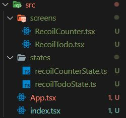

# React Recoil 사용하기

## 1. Recoil

Recoil은 메타(구 페이스북)에서 만든 상태 관리 라이브러리이다. 기존의 Redux와 같은 상태 관리 라이브러리들은 store 구성을 위해 많은 boilerplate 코드들을 필요로 했고, 이로 인하여 설정이 복잡해지게 되었다. Recoil은 이러한 문제의 해결과 전역 상태 관리의 최적화 및 성능과 효율성 향상을 위해 만들어졌다. 또한 React를 공식적으로 지원하는 상태 관리 라이브러리이기 때문에 React 내부에 접근이 가능하며 Concurrent 모드, Suspense 등을 손쉽게 사용할 수 있다.

## 1-1. Redux란?

## 1-2. Redux와 Recoil의 차이점

## 2. Recoil의 특징

- atom : Recoil에서 상태를 정의하는 개념. (Redux의 store와 유사한 개념)<br>
  컴포넌트가 구독할 수 있는 state이며 atom을 생성하기 위해 고유한 key와 default값 설정이 필요.<br>
  atom의 값이 변경되면 해당 atom을 구독하고 있는 컴포넌트들이 모두 다시 re-render됨.
- selector : 파생된 상태(derived state)의 데이터를 의미<br>
  read-only 객체이며 순수 함수. <br>
  Recoil에서 관리하는 상태의 일부만 선택하거나, 상태를 이용하여 연산한 값을 조회할 때 사용. <br>
  비동기 처리를 통해 atom에 의존적인 동적인 데이터 사용 가능.

## 3.Recoil 사용하기

### 3-1. Recoil 설치

```
$ yarn add recoil
$ npm install recoil
```

### 3-2. Recoil 환경 세팅

먼저, src 하위에 아래와 같이 파일 구조를 만들어준다.



### 3-3. RecoilRoot

RecoilRoot는 애플리케이션에서 Recoil을 연동하기 위해 사용한다. Redux에서 Provider를 이용하여 store를 설정했던 것과 비슷한 역할을 한다.

- RecoilRoot <br>
  여러 개의 RecoilRoot를 사용 가능하며 이러한 경우에 각각의 RecoilRoot는 독립적인 provider/store로 동작. <br>
  RecoilRoot의 override 속성이 false인 경우, atom state는 각각의 RecoilRoot에 따라 다른 값을 갖게 됨. <br>
  RecoilRoot의 override 속성이 true인 경우, atom는 중첩된 RecoilRoot에 따라 동일한 값을 갖게 됨.

index.tsx 파일을 다음과 같이 작성해주자.

```js
import React from "react";
import ReactDOM from "react-dom";
import { RecoilRoot } from "recoil";
import App from "./App";

ReactDOM.render(
  <RecoilRoot>
    <App />
  </RecoilRoot>,
  document.getElementById("root")
);
```

### 3-4 atom

atom은 Recoil에서 상태를 정의하여 사용하기 위한 방법이다. atom을 이용하여 상태를 정의할 때는 고유값(key)과 기본값(default)을 설정해준다.

atom을 이용하여 다음과 같이 상태를 정의해준다.

```js
const recoilCounterState = atom({
  key: "recoilCounterState",
  default: initialState,
});
```

atom으로 정의한 상태는 아래의 Hook을 이용하여 사용할 수 있다.

```js
const [recoilCounter, setRecoilCounter] = useRecoilState(recoilCounterState);
const recoilCounterValue = useRecoilValue(recoilCounterState);
const setRecoilCounter = useSetRecoilState(recoilCounterState);
const resetRecoilCounter = useResetRecoilState(recoilCounterState);
```

각각의 Hook은

- useRecoilState <br>
  atom의 상태를 구독<br>
  useState Hook과 같이 배열의 첫번째 파라미터로 상태, 두번째 파라미터로 상태에 대한 setter 함수를 반환.
- useRecoilValue <br>
  setter 함수 없이 atom의 상태만 반환.
- useSetRecoilState <br>
  atom 상태 없이 setter 함수만 반환.
- useResetRecoilState <br>
  atom 상태를 default 상태로 reset.

컴포넌트에서의 동작 확인을 위해 먼저 states/recoilCounterState.ts, states/recoilTodoState.ts 파일을 작성해준다.

```js
/* states/recoilCounterState.ts */

import { atom, selector } from "recoil";

export interface CommonState {
  value: number;
}

const initialState: CommonState = {
  value: 0,
};

export const recoilCounterState = atom({
  key: "recoilCounterState",
  default: initialState,
});
```

```js
/* states/recoilTodoState.ts */

import { atom, selector } from "recoil";

interface TodoItem {
  id: number;
  title: string;
  checked: boolean;
}

export interface CommonState {
  todoList: TodoItem[];
}

const initialState: CommonState = {
  todoList: [],
};

export const recoilTodoState = atom({
  key: "recoilTodoState",
  default: initialState,
});
```
