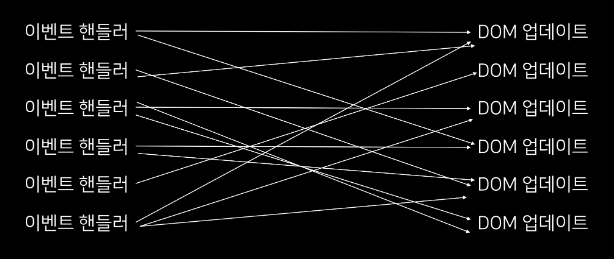
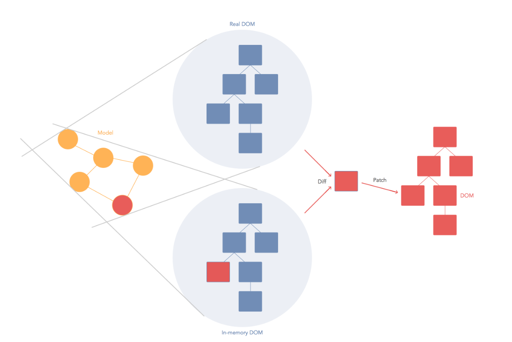

# 01. 리액트는 어쩌다 만들어졌을까?

리액트 학습을 본격적으로 하기 전에, 리액트라는 라이브러리가 어쩌다 만들어졌는지를 알면 리액트를 이해 하는데 도움이 될 것입니다.

> [DOM이란?](https://developer.mozilla.org/ko/docs/Web/API/Document_Object_Model/Introduction)

> 인터랙션이란? inter + action, 정보 액션으로 상호작용을 뜻한다.<br>
> 예로 문 앞에 사람이 있다고 가정하여 문고리는 '인터페이스', 문을 열고 나가는 행위를 인터랙션(상호작용)이라고 한다.

JavaScript를 사용하여 HTML로 구성한 UI를 제어해보셨다면, DOM을 변형시키기 위하여 우리가 어떤 작업을 진행해야하는지 익숙 할 것입니다.
브라우저의 DOM Selector API를 사용해서 특정 DOM을 선택한 뒤, 특정 이벤트가 발생하면 변화를 주도록 설정해야 합니다.

HTML/JS로 만들어진 [카운터 예시](../counter.html)를 확인해보자.

```html
<h2 id="number">0</h2>
<div>
  <button id="increase">+1</button>
  <button id="decrease">-1</button>
</div>
```

위와 같이 HTML이 구성되어 있고, id를 사용하여 각 DOM을 선택한 뒤, 원하는 이벤트가 발생하면 DOM의 특정 속성을 바꿔주게된다.

```js
const number = document.getElementById("number");
const increase = document.getElementById("increase");
const decrease = document.getElementById("decrease");

increase.onclick = () => {
  const current = parseInt(number.innerText, 10);
  number.innerText = current + 1;
};

decrease.onclick = () => {
  const current = parseInt(number.innerText, 10);
  number.innerText = current - 1;
};
```

현재 위 코드를 보면 "+1 버튼이 눌리면, id가 number인 DOM을 선택해서 innerText 속성을 1씩 더해줘라" 라는 규칙이 있다. 사용자와의 인터랙션이 별로 없는 웹 페이지라면 상관없겠지만, 만약에 인터랙션이 자주 발생하고, 이에 따라 동적으로 UI를 표현해야된다면, 이러한 규칙이 정말 다양해질것이고, 그러면 관리하기도 힘들어질 것입니다. 숙련된 JavaScript 개발자라면, 코드를 최대한 깔끔하게 정리하여 쉽게 유지보수를 할 수도 있겠지만, 대부분의 경우 웹 애플리케이션의 큐모가 커지면, DOM을 직접 건드리면서 작업을 하면 코드가 난잡해지기 쉽습니다.

처리해야 할 이벤트도 다양해지고, 관리해야 할 상태값도 다양해지고, DOM도 다양해지게 된다면, 이에 따라 업데이트를 하는 규칙도 많이 복잡해지기 때문에, 조금 과장을 많이 하자면 코드가 다음과 같은 형태가 됩니다.

<p align="center">
  
</p>

그래서, Ember, Backbone, AngularJS 등의 프레임워크가 만들어졌는데, 이 프레임워크들은 작동방식이 각각 다르지만, 쉽게 설명하자면 자바스크립트의 특정한 값이 바뀌면 특정 DOM의 속성이 바뀌도록 연결을 해주어서, 업데이트 하는 작업을 간소화해주는 방식으로 웹개발의 어려움을 해결해주었습니다.

하지만 리액트의 경우에는 조금 다른 발상에서 만들어졌습니다. 리액트는 어떠한 상태가 바뀌었을 때, 그 상태에 따라 DOM을 어떻게 업데이트 할 지 규칙을 정하는 것이 아니라, 아예 다 날려버리고 처음부터 모든 걸 새로 만들어서 보여준다면 어떨까? 라는 아이디어에서 개발이 시작되었습니다.

그러면 "업데이트를 어떻게 해야 할 지"에 대한 고민을 전혀 안해도 되기 때문에 개발이 정말 쉬워질 것입니다. 하지만, 정말로 동적인 UI를 보여주기 위해서 모든 걸 다 날려버리고 모든걸 새로 만들게 된다면, 속도가 굉장히 느릴 것 입니다. 작은 웹 애플리케이션이라면 상관없겠지만 규모가 큰 웹 애플리케이션이라면 상상도 할 수 없는 일이다.

하지만, 리액트에서는 **Virtual DOM** 이라는 것을 사용해서 이를 가능케 했습니다.

<p align="center">
  
</p>

Virtual DOM은 가상의 DOM인데요, 브라우저에 실제로 보여지는 DOM이 아니라 그냥 메모리에 가상으로 존재하는 DOM으로서 그냥 JavaScript 객체이기 때문에 작동 성능이 실제로 브라우저에서 DOM을 보여주는 것보다 속도가 훨씬 빠릅니다. 리액트는 상태가 업데이트 되면, 업데이트가 필요한 곳의 UI를 Virtual DOM을 통해서 렌더링합니다. 그리고 나서 리액트 개발 팀이 만든 매우 효율적인 비교 알고리즘을 통하여 실제 브라우저에 보여지고 있는 DOM과 비교를 한 후, 차이가 있는 곳을 감지하여 이를 실제 DOM에 패치 시켜줍니다. 이를 통하여, "업데이트를 어떻게 할 지"에 대한 고민을 하지 않으면서, 빠른 성능도 지켜낼 수 있게 되었습니다.

---

# 요약

## 배경

- DOM을 직접 건드리는 작업은 번거롭다.

## React의 발상

- DOM을 전부 날려버리고 다시 만들어서 보여주자.

## 문제점

- 매번 이렇게 하게되면 다양한 문제가 발생

## 해결

- 메모리에 가장 DOM을 만든다.
- 업데이트가 필요한 부분만 가장 DOM으로 수정한다.
- 그 이후 React의 알고리즘을 통해 다른 부분을 감지하여 실제 DOM에 패치 시켜준다.
