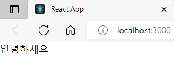
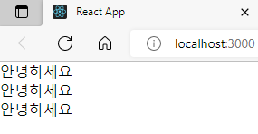

# 나의 첫 리액트 컴포넌트

> JSX란? 리액트 컴포넌트에서 xml 형식의 값을 반환하는 것.

src 디렉터리에 Hello.js라는 파일을 다음과 같이 작성해보자.

Hello.js

```js
import React from "react";

function Hello() {
  return <div>안녕하세요</div>;
}
export default Hello;
```

리액트 컴포넌트를 만들 땐

```js
import React from "react";
```

를 통하여 리액트를 불러와야 한다.

리액트 컴포넌트는 함수형태로 작성 할 수도 있고 클래스 형태로도 작성할 수 있습니다. 지금 단계에서는 함수로 작성하는 방법에 대해서만 알아보겠습니다.

리액트 컴포넌트에서는 XML 형식의 값을 반환해줄 수 있는데 이를 JSX라고 부릅니다.

코드의 최하단

```js
export default Hello;
```

이 코드는 Hello 라는 컴포넌트를 내보내겠다는 의미입니다. 이렇게 해주면 다른 컴포넌트에서 불러와서 사용할 수 있습니다.

이 컴포넌트를 한번 App.js에서 불러와서 사용해보겠습니다.

App.js

```js
import React from "react";
import Hello from "./Hello";

function App() {
  return (
    <div>
      <Hello />
    </div>
  );
}

export default App;
```

상단에 있던

```js
import logo from "./logo.svg";
import "./App.css";
```

는 SVG 파일을 불러오고, CSS를 적용하는 코드인데 이는 현재 불필요 하므로 제거해 주었습니다.

<p align="center">
  
</p>

컴포넌트는 일종의 UI 조각입니다. 그리고, 쉽게 재사용할 수도 있습니다.

```js
import React from "react";
import Hello from "./Hello";

function App() {
  return (
    <div>
      <Hello />
      <Hello />
      <Hello />
    </div>
  );
}

export default App;
```

<p align="center">
  
</p>

이제 index.js를 열어보자.
이런 코드가 보일 것이다.

```js
import React from "react";
import ReactDOM from "react-dom/client";
import "./index.css";
import App from "./App";
import reportWebVitals from "./reportWebVitals";

const root = ReactDOM.createRoot(document.getElementById("root"));
root.render(
  <React.StrictMode>
    <App />
  </React.StrictMode>
);

// If you want to start measuring performance in your app, pass a function
// to log results (for example: reportWebVitals(console.log))
// or send to an analytics endpoint. Learn more: https://bit.ly/CRA-vitals
reportWebVitals();
```

여기서 ReactDOM.render의 역할은 브라우저에 있는 실제 DOM 내부에 리액트 컴포넌트를 렌더링하겠다는 것을 의미합니다.

id가 root인 DOM을 선택하고 있는데, 이 DOM이 어디있는지 확인해보자.

public/index.html을 열어보면 내부에

```js
<div id="root"></div>
```

을 찾아볼 수 있다.
결국, 리액트 컴포넌트가 렌더링 될 때에는, 렌더링된 결과물이 위 div 내부에 렌더링되는 것입니다.

# 요약

- 리액트 컴포넌트는 XML 형식의 값을 반환한다. (JSX)
- 컴포넌트는 일종의 UI 조각 (쉽게 재사용 가능)
- 실제 DOM 내부에 리액트 컴포넌트를 렌더링

```js
ReactDOM.render(document.getElementById("root"));
```
