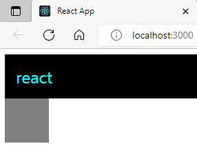
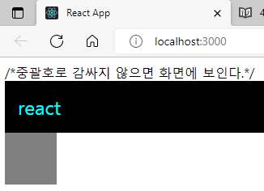

# JSX의 기본 규칙 알아보기

JSX는 리액트에서 생김새를 정의할 때, 사용하는 문법입니다. 얼핏보면 HTML 같이 생겼지만 실제로는 JavaScript입니다.

```js
return <div>안녕하세요</div>;
```

리액트 컴포넌트 파일에서 XML 형태로 코드를 작성하면 babel이 JSX를 JavaScript로 변환을 해줍니다.

Babel은 자바스크립트의 문법을 확장해주는 도구입니다. 아직 지원되지 않는 최신 문법이나, 편의상 사용하거나 실험적인 자바스크립트 문법들을 정식 자바스크립트 형태로 변환해줌으로서 구형 브라우저 같은 환경에서도 제대로 실행 할 수 있게 도와주는 역할을 합니다.

---

## 꼭 닫혀야하는 태그

1. Self Closing 태그

   - 태그와 태그 사이에 내용이 들어가지 않을 때 사용

   ```js
   import React from 'react';
   import Hello from './Hello';

   function App() {
       return (
       <div>
           <Hello />
           <Hello />
           <Hello />
           <div> // 오류 태그는 꼭 닫혀있어야 한다.
       </div>
     );
   }
    export default App;

   ```

---

2. 꼭 감싸져야하는 태그
   - 두개 이상의 태그는 무조건 하나의 태그로 감싸져있어야 한다.

```js
import React from 'react';
import Hello from './Hello';

function App() {
  return (
    <Hello />
    <div>안녕히계세요.</div>
  );
}

export default App;

```

```js
import React from 'react';
import Hello from './Hello';

function App() {
  return (
    <div> //이런식으로 <div>으로 태그를 감싸주어야한다.
      <Hello />
      <div>안녕히계세요</div>
    </div>
  );
}

export default App;
```

하지만, 이렇게 단순히 감싸기 위해 불필요한 div로 감싸는게 별로 좋지 않은 상황도 있습니다. 예로 스타일 관련 설정을 하다가 복잡해지게 되는 상황도 올 수 있고, table 관련 태그를 작성할 때에도 내용을 div 같은 걸로 감싸기엔 애매하다. 그럴 땐, 리액트의 Fragment라는 것을 사용하면 된다.

3. Fragment

```js
import React from "react";
import Hello from "./Hello";

function App() {
  return (
    <>
      {" "}
      //빈 태그를 넣어준다.
      <Hello />
      <div>안녕히계세요</div>
    </>
  );
}

export default App;
```

---

## JSX 안에 자바스크립트 값 사용하기

JSX 내부에 자바스크립트 변수를 보여줘야 할 때는 {}으로 감싸서 보여준다.

```js
import React from "react";
import Hello from "./Hello";

function App() {
  const name = "react";
  return (
    <>
      <Hello />
      <div>{name}</div>
    </>
  );
}

export default App;
```

---

## style과 className

JSX에서 태그에 style과 CSS class를 설정하는 방법은 HTML에서 설정하는 방법과 다릅니다.

우선, 인라인 스타일은 객체 형태로 작성을 해야하며, background-color 처럼 - 로 구분되어 있는 이름들은 backgroundColor 처럼 camelCase 형태로 네이밍 해주어야 합니다.

```js
import React from "react";
import Hello from "./Hello";

function App() {
  const name = "react";
  const style = {
    backgroundColor: "black",
    color: "aqua",
    fontSize: 24, // 기본 단위 px
    padding: "1rem", // 다른 단위 사용 시 문자열로 설정
  };

  return (
    <>
      <Hello />
      <div style={style}>{name}</div>
    </>
  );
}

export default App;
```

그리고, CSS class를 설정할 때에는 class= 가 아닌 className= 으로 설정을 해주어야 합니다. 한번, App.css 파일을 열어서 전체 내용을 지운뒤 다음과 같이 수정해주세요.

App.css

```js
.gray-box {
  background: gray;
  width: 64px;
  height: 64px;
}
```

App.js

```js
import React from "react";
import Hello from "./Hello";
import "./App.css";

function App() {
  const name = "react";
  const style = {
    backgroundColor: "black",
    color: "aqua",
    fontSize: 24, // 기본 단위 px
    padding: "1rem", // 다른 단위 사용 시 문자열로 설정
  };

  return (
    <>
      <Hello />
      <div style={style}>{name}</div>
      <div className="gray-box"></div>
    </>
  );
}
```

<p align="center">
  
</p>

---

## 주석

이제 JSX에서 주석은 어떻게 작성하는지 알아보자.
JSX 내부의 주석은 {/_ 이런 형태로 _/} 작성합니다.

```js
import React from "react";
import Hello from "./Hello";
import "./App.css";

function App() {
  const name = "react";
  const style = {
    backgroundColor: "black",
    color: "aqua",
    fontSize: 24, // 기본 단위 px
    padding: "1rem", // 다른 단위 사용 시 문자열로 설정
  };

  return (
    <>
      {/* 주석은 화면에 보이지 않습니다 */}
      /* 중괄호로 감싸지 않으면 화면에 보입니다 */
      <Hello />
      <div style={style}>{name}</div>
      <div className="gray-box"></div>
    </>
  );
}

export default App;
```

<p align="center">
  
</p>

# 요약

1. Babel이란?
   - 자바스크립트 문법을 확장해주는 도구
   - 아직 지원하지 않는 최신 문법을 정식 자바스크립트로 변환해준다.
2. JSX 란?
   - 리액트에서 생김새를 정의할 때 사용하는 문법
   - 리액트 컴포넌트 파일에서 XML 형태로 코드를 작성하면 babel이 JSX를 JavaScript로 변환
3. JSX 규칙
   - 태그는 꼭 닫혀야 한다.
     - 두개 이상의 태그가 존재한다면 꼭 하나의 태그로 감싸주어야 한다.
     - Fragment : 단순히 감싸기 용도로 태그를 이용해야할 때 사용
     - 형태 : <></>
   - JSX 내부에 JavaScript 변수(값)를 사용할 때에는 {}를 사용한다.
   - JSX에서 style과 CSS class
     - 인라인 스타일은 객체 형태로 작성 & camelCase 형태로 네이밍
     - class는 className= 으로 설정
   - JSX 내부의 주석
     - {/＊ 이런 형태로＊/}
     - 열리는 태그 내부에서는 //이런 형태로도 가능
