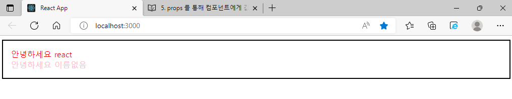

# props를 통해 컴포넌트에게 값 전달하기

이번에는 컴포넌트의 props라는 개념에 대해서 알아보겠습니다. props는 properties의 줄임말입니다. 우리가 어떠한 값을 컴포넌트에게 전달해줘야 할 때, props를 사용합니다.

---

## props의 기본 사용법

예를 들어서, App 컴포넌트에서 Hello 컴포넌트를 사용할 때 name 이라는 값을 전달해주고 싶다고 가정해봅시다. 그러면, 이렇게 코드를 작성하면 됩니다.

App.js :

```js
import React from "react";
import Hello from "./Hello";

function App() {
  return <Hello name="react" />;
}

export default App;
```

이제, Hello 컴포넌트에서 name 값을 사용하고 싶을 땐 어떻게 하면 되는지 알아보자.

Hello.js :

```js
import React from "react";

function Hello(props) {
  return <div>안녕하세요 {props.name}</div>;
}

export default Hello;
```

컴포넌트에게 전달되는 props는 파라미터를 통하여 조회할 수 있습니다. props는 객체 형태로 전달되며, 만약 name 값을 조회하고 싶다면 props.name을 조회하면 됩니다.

---

## 여러 개의 props, 비구조화 할당

Hello 컴포넌트에 또 다른 props를 전달해봅시다. color라는 값을 설정해보자.

App.js :

```js
import React from "react";
import Hello from "./Hello";

function App() {
  return <Hello name="react" color="red" />;
}

export default App;
```

그 다음엔, Hello 컴포넌트에서 color 값을 조회해서 폰트의 색상으로 설정을 해보자.

Hello.js :

```js
import React from "react";

function Hello(props) {
  return <div style={{ color: props.color }}>안녕하세요 {props.name}</div>;
}

export default Hello;
```

<p align="center">
  
</p>

---

## defaultProps로 기본값 설정

컴포넌트에 props를 지정하지 않았을 때, 기복적으로 사용할 값을 설정하고 싶다면 컴포넌트에 defaultProps 라는 값을 설정하면 됩니다.

Hello.js :

```js
import React from "react";

function Hello({ color, name }) {
  return <div style={{ color }}>안녕하세요 {name}</div>;
  // {{color}} 가장 밖 {}는 jsx문법, 안쪽 {}는 객체 리터럴
}

Hello.defaultProps = {
  name: "이름없음",
};

export default Hello;
```

한 번, App에서 name이 없는 Hello 컴포넌트를 렌더링해보자.

App.js :

```js
import React from "react";
import Hello from "./Hello";

function App() {
  return (
    <>
      <Hello name="react" color="red" />
      <Hello color="pink" />
    </>
  );
}

export default App;
```

<p align="center">
  
</p>

---

## props.children

컴포넌트 태그 사이에 넣은 값을 조회하고 싶을 땐, props.children을 조회하면 된다.

이번에, props.children을 사용하는 새로운 컴포넌트를 만들어보자.

Wrapper.js를 src 디렉터리에 만들어보자.

Wrapper.js :

```js
import React from "react";

function Wrapper() {
  const style = {
    border: "2px solid black",
    padding: "16px",
  };
  return <div style={style}></div>;
}

export default Wrapper;
```

이 컴포넌트를 App에서 사용해보자.

App.js :

```js
import React from "react";
import Hello from "./Hello";
import Wrapper from "./Wrapper";

function App() {
  return (
    <Wrapper>
      <Hello name="react" color="red" />
      <Hello color="pink" />
    </Wrapper>
  );
}

export default App;
```

이렇게 Wrapper 태그 내부에 Hello 컴포넌트 두 개를 넣었는데, 브라우저를 확인하면 다음과 같이 Hello 컴포넌트들은 보여지지 않을 것이다.

<p align="center">
  
</p>

내부의 내용이 보여지게 하기 위해서는 Wrapper에서 props.children을 렌더링해주어야 합니다.

<p align="center">
  
</p>

# 요약

1. 여러 개의 props는 비구조화 할당으로 간결하게 작성
   - props 내부의 값을 조회할 때마다 props.를 입력하는데 이것을 줄이기 위해 컴포넌트의 파라미터에서 {}안에 받는 내용을 미리 표기한다.
   ```
   function Hello({name}) {
      return <div>{name}</div>
   }
   ```
2. defaultProps로 기본값 설정 가능
   - 컴포넌트에 props를 지정하지 않았을 때 기본값을 설정하고 싶을 때
3. props.children
   - 컴포넌트 태그 사이에 넣은 값을 조회하고 싶을 땐, props.children
