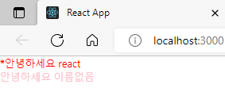

## 1. 조건부 렌더링

조건부 렌더링이란, 특정 조건에 따라 다른 결과물을 렌더링 하는 것을 의미합니다.
예를 들어서, App 컴포넌트에서 Hello 컴포넌트를 사용할 때, isSpecial 이라는 props를 설정해보자.

App.js :

```js
import React from "react";
import Hello from "./Hello";
import Wrapper from "./Wrapper";

function App() {
  return (
    <Wrapper>
      <Hello name="react" color="red" isSpecial={true} />
      <Hello color="pink" />
    </Wrapper>
  );
}

export default App;
```

여기서 true는 자바스크립트 값이기 때문에 중괄호{}로 감싸주었습니다.

그리고, Hello 컴포넌트에서는 isSpecial이 true 냐, false 냐에 따라서 컴포너트의 좌측에 \* 표시를 보여주는 코드를 작성해보자.

이를 처리하는 가장 기본적인 방법은, "**삼항연산자**"를 사용하는 것입니다.

Hello.js

```js
import React from "react";

function Hello({ color, name, isSpecial }) {
  return (
    <div style={{ color }}>
      {isSpecial ? <b>*</b> : null}
      안녕하세요 {name}
    </div>
  );
}

Hello.defaultProps = {
  name: "이름없음",
};

export default Hello;
```

isSpecial 값이 true라면 <b>\*</b>를, 그렇지 않다면 null을 보여주도록 했습니다.

※ 참고로 JSX에선 null, false, undefined를 렌더링하게 된다면 아무것도 출력되지 않습니다.

<p align="center">
  
</p>

보통 삼항연산자는 사용한 조건부 렌더링을 주로 특정 조건에 따라 보여줘야 하는 내용이 다를 때 사용합니다.

지금은 내용이 달라지는게 아니라, 단순히 특정조건이 true 이면 보여주고, 그렇지 않다면 숨겨주고 있는데, 이러한 상황에서는 && 연산자를 사용해서 처리하는 것이 더 간편합니다.

Hello.js

```js
import React from "react";

function Hello({ color, name, isSpecial }) {
  return (
    <div style={{ color }}>
      {isSpecial && <b>*</b>}
      안녕하세요 {name}
    </div>
  );
}

Hello.defaultProps = {
  name: "이름없음",
};

export default Hello;
```

```
isSpecial && <b>*</b>의 결과는 isSpecial이 false 일땐 false이고, isSpecial이 true일 땐 <b>*</b>가 됩니다.
```

### props 값 설정을 생략하면 = {true}

컴포넌트의 props 값을 설정하게 될 때 만약 props 이름만 작성하고 값 설정을 생략한다면, 이를 true로 설정한 것으로 간주하게 됩니다.

예를 들자면,

App.js

```js
import React from "react";
import Hello from "./Hello";
import Wrapper from "./Wrapper";

function App() {
  return (
    <Wrapper>
      <Hello name="react" color="red" isSpecial />
      <Hello color="pink" />
    </Wrapper>
  );
}

export default App;
```

이렇게 isSpecial 이름만 넣어주면 isSpecial={true}와 동일한 의미가 됩니다.

---

# 요약

1. 삼항 연산자를 사용한 조건부 렌더링
   - 주로 특정 조건에 따라 보여줘야 하는 내용이 다를 때 사용
   - JSX에선 null, false, undefined를 렌더링 하게 되면 아무것도 나타나지 않음
   - 보여주고 숨기고의 단순한 처리라면 && 연산자를 사용
2. props 값 설정을 생략하면 ={true}로 간주
