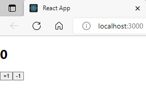

# useState를 통해 컴포넌트에서 바뀌는 값 관리하기

지금까지 우리가 리액트 컴포넌트를 만들 땐, 동적인 부분이 하나도 없었다. 이번엔 컴포넌트에서 보여줘야 하는 내용이 사용자 인터랙션에 따라 바뀌어야 할 때 어떻게 구현할 수 있는지에 대하여 알아보자.

이번엔 useState라는 함수를 사용하게 될텐데, 이것은 리액트 Hooks 중 하나입니다.

Counter 컴포넌트로 연습해보자.

## 1. UI 작성

Counter.js :

```js
import React from "react";

function Counter() {
  return (
    <div>
      <h1>0</h1>
      <button>+1</button>
      <button>-1</button>
    </div>
  );
}

export default Counter;
```

<p align="center">
  
</p>

## 2. 이벤트 설정

이제, Counter에서 버튼이 클릭되는 이벤트가 발생 했을 때, 특정 함수가 호출되도록 설정을 해보자.

Counter.js :

```js
import React from "react";
function Counter() {
  const onIncrease = () => {
    console.log("+1");
  };
  const onDecrease = () => {
    console.log("-1");
  };
  return (
    <div>
      <h1>0</h1>
      <button onClick={onIncrease}>+1</button>
      <button onClick={onDecrease}>-1</button>
    </div>
  );
}

export default Counter;
```

여기서 onIncrease와 onDecrease는 화살표 함수를 사용하여 구현을 해주었다.

함수를 만들고, button의 onClick으로 각 함수를 연결해주었습니다.

리액트에서 엘리먼트에 이벤트를 설정할 땐, on이벤트이름={실행하고자 하는 함수 이름} 형태로 설정해주어야한다.

주의할 점으로

```
onClick={onIncrease()} X onClick={onIncrease} O
```

함수 선언이 아닌 값으로 넣어줘야한다.

## 3. 동적인 값 넣기, useState

컴포넌트에서 동적인 값을 상태(state)라고 부릅니다.

리액트에 useState라는 함수가 있는데, 이것을 사용하면 컴포넌트에서 상태를 관리할 수 있습니다.

Counter.js

```js
iimport React, { useState } from "react";

function Counter() {
  const [number, setNumber] = useState(0);

  const onIncrease = () => {
    setNumber(number + 1);
  };
  const onDecrease = () => {
    setNumber(number - 1);
  };
  return (
    <div>
      <h1>{number}</h1>
      <button onClick={onIncrease}>+1</button>
      <button onClick={onDecrease}>-1</button>
    </div>
  );
}

export default Counter;
```

```
const [number, setNumber] = useState(0);
```

useState를 사용할 때에는 상태의 기본값을 파라미터로 넣어서 호출해줍니다. 이 함수를 호출해주면 배열이 반환되는데, 여기서 첫 번째 원소는 현재 상태, 두 번째 원소는 Setter 함수 입니다.

원래의 형태는 이렇습니다.

```js
const numberState = useState(0);
const number = numberState[0];
const setNumber = numberState[1];
```

[배열 비구조화 할당](https://learnjs.vlpt.us/useful/06-destructuring.html#%EB%B0%B0%EC%97%B4-%EB%B9%84%EA%B5%AC%EC%A1%B0%ED%99%94-%ED%95%A0%EB%8B%B9)을 통하여 각 원소를 추출해준 것입니다.

```js
const onIncrease = () => {
  setNumber(number + 1);
};

const onDecrease = () => {
  setNumber(number - 1);
};
```

Setter 함수는 파라미터로 전달 받은 값을 최신 상태로 설정해줍니다.

## 4. 함수형 업데이트

지금은 Setter 함수를 사용할 때, 업데이트 하고 싶은 새로운 값을 파라미터로 넣어주고 있는데, 그 대신에 기존 값을 어떻게 업데이트 할지에 대한 함수를 등록하는 방식으로 값을 업데이트 할 수 있습니다.

Counter.js :

```js
import React, { useState } from "react";

function Counter() {
  const [number, setNumber] = useState(0);

  const onIncrease = () => {
    setNumber((prevNumber) => prevNumber + 1);
  };

  const onDecrease = () => {
    setNumber((prevNumber) => prevNumber - 1);
  };

  return (
    <div>
      <h1>{number}</h1>
      <button onClick={onIncrease}>+1</button>
      <button onClick={onDecrease}>-1</button>
    </div>
  );
}

export default Counter;
```

onIncrease와 onDecrease에서 setNumber를 사용할 때 그 다음 상태를 파라미터로 넣어준것이 아니라, 값을 업데이트 하는 함수를 파라미터로 넣어주었습니다.

함수형 업데이트는 주로 나중에 컴포넌트를 최적화 하게 될 때 사용하게 됩니다. 지금 당장은 함수형 업데이트란게 있구나 이해하고 넘어가자.

---

# 요약

1. useState : 상태(state: 동적인 값)를 관리

   - 첫 번째 원소는 현재 상태, 두 번째 원소는 Setter 함수
   - 배열 비구조화 할당을 통하여 각 원소를 추출

2. 리액트에서 엘리먼트에 이벤트를 설정할 땐,

   - onClick={실행하고 싶은 함수} 형태로 설정한다.

3. 함수형 업데이트
   - Setter에 함수를 등록하는 방식으로 값을 업데이트
   - 컴포넌트를 최적화할 때 사용
