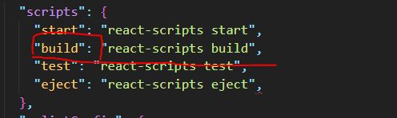
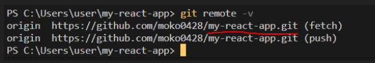
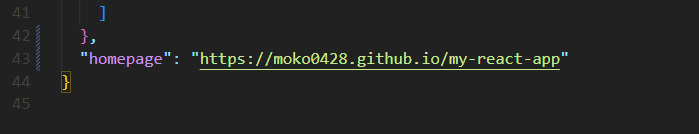
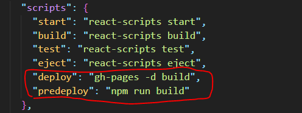
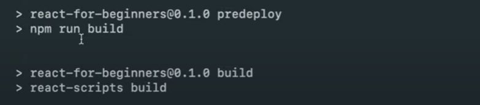

# Publishing

github pages에 deploy 하는 방법

1. gh-pages 툴 설치하기
   - 터미널에 npm i gh-pages 입력
     - 결과물을 github pages에 업로드 할 수 있게 도와주는 패키지
     - github에서 제공하는 무료 서비스
     - html, css, js를 올리면 그걸 웹 사이트로 만들어서 전세계에 무료로 배포해준다. (도메인도 가지게됨)
2. package.json에 있는 scripts 확인하기

   - build : 빌드라는 스크립트를 실행하면 웹 사이트의 production ready code를 생성하게 된다. 
   production ready란 코드가 압축되고 모든게 최적화 된다는 의미이다.
   

      
   

   - build 실행 시키기
     - npm run build
     - 실행하는데 조금 오래 걸린다. 이유는 압축하고, 최적화하는 등 모든걸 해야하기 때문
     - 실행하고 나면 현 폴더아래 build라는 폴더가 생긴다.
     - build의 폴더 안에는 수많은 js 파일들이 있고 이 파일들은 브라우저가 이해할 수 있는 언어로 압축된 파일이다.

3. github에 push하기전에 해야할 일

   - package.json 파일로 가서 맨 아래 두번째 닫는 중괄호에 콤마(,)를 찍고 그 아래에 "homepage":"https://[GitHub username].github.io/[현재 repository 이름]"을 적어준다.
   - 아직 레포가 없다면 생성하고 푸시를 해준다.
   - 현재 레포의 이름을 알고 싶다면 터미널에 git remote -v를 실행해보면 자신의 레포 이름을 확인할 수 있다.
     
    

      
   

    

      
   

- 3-2. scripts 수정
  - deploy 추가 - "deploy" : "gh-pages -d build"
    - deploy가 하는 일은 우리가 방금 설치한 gh-pages를 실행시키고 "build"라는 디렉토리를 가져간다.
    - 먼저 build를 하고 난 다음에 deploy를 해야한다는걸 기억하고 싶지 않기 때문에 predeploy command를 만들어준다.
  - predeploy command 추가 - "predeploy" : "npm run build"
    - deploy를 실행시키면 predeploy가 자동으로 먼저 실행이 되고, predeploy는 npm run build를 실행시킨다.
      

        
      

- 3-3. deploy 실행시키기
  - npm run deploy
  

    
     

위 사진에서 보이는 바와 같이, predeploy가 먼저 실행되고, deploy가 그 다음에 실행되는 것을 확인할 수 있다.

predeloy는 npm run build를 실행시키고, npm run build는 react-scripts build를 실행시키고, 이것이 최적화된 것들을 만들어내고, 그게 끝나면 deploy의 gh-pages -d build가 실행된다.

gh-pages -d build가 하는 일은 gh-pages가 build 폴더를 package.json 하단에 적은 homepage 웹 사이트에 업로드하도록 해주는 것이다.

적은 웹 사이트 주소를 접속하면 조금의 시간이 지난 다음에 실행된다.
404페이지가 나와도 당황하지 말자. 최대 5분 정도의 시간이 지난 후에 웹 페이지가 열린다.
