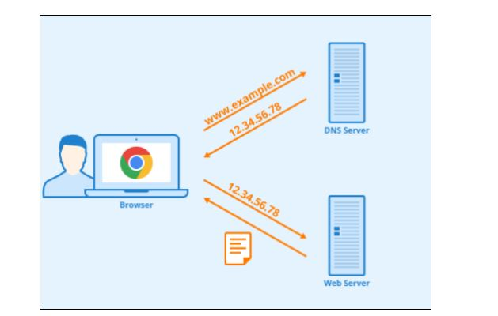

# DNS, 그리고 동작 방식

## IP 주소 및 인터넷과 웹, 그리고 도메인 주소란?

우리는 컴퓨터의 데이터가 전송되는 방법에 대해 배운것이다. 즉, 송신자와 수신지를 어떻게 구분해야 하는지는 모른다. 예를 들어 택배 배송 과정은 배웠는데 택배 발송지와 택배 수신지를 모르는 것과 같다. 실제 우리 생활에서는 이를, 주소를 이용하여 해결한다. 컴퓨터 역시 유사하다. 'IP 주소' 라는 것을 이용하여 컴퓨터의 고유한 주소를 매긴다.

```
192.168.0.10
```

위와 같은 형식으로 다른 컴퓨터의 주소로 접근하는 것이다. 우리가 항상 이렇게 숫자로 구성되어 있는 주소를 암기하기가 어렵다. 그래서 '도메인 이름'이라고 하는 것을 이용하여 IP주소를 지칭하도록 또 하나의 주소를 생성한다.

```
192.168.0.10 = www.google.com
```

위와 같이 IP주소를 www.google.com 도메인으로 지정하게 되면 둘의 위치는 같은 곳을 가리키게 된다.

## DNS 서버(Domain Name System)란 무엇일까?

위에서 언급했듯이 DNS란 사람이 읽을 수 있는 형태로 IP 주소를 도메인 이름으로 변환한 것이다.

그렇다면 변환해주는 역할을 하는 그 무언가는 무엇일까?

그것이 바로 DNS Server(도메인 서버)이다.

## DNS 원리 (도메인 서버 질의-응답 과정)

DNS 시스템은 이름(도메인 주소)과 숫자(IP 주소) 간의 매핑을 관리하는 기능을 제공한다. 우리가 웹 서버에 접속하여 네이버의 도메인 주소(www.naver.com)을 입력하면 'www.naver.com'를 가지고 있는 DNS 서버로 도메인 주소에 대한 요청을 보낸다. 이러한 과정을 '**질의**'라고 한다. 이후, DNS 서버가 IP 주소로 변환하여 '**응답**'함으로서 최종 사용자(End User)가 웹 브라우저에 입력한 서버로 접근이 되는 것이다.

<p align="center">
  
</p>

## DNS 원리 심화

1. PC의 웹 브라우저에서 'www.naver.com'과 같은 형식으로 도메인 주소로 웹에 접근한다.
2. PC에 미리 지정되어 있던 Primary DNS Server 또는 Secondary DNS Server으로 우리가 접근하게 될 도메인 주소에 대한 IP 주소를 질의한다.
   > 여기서부턴 Primary DNS Server, Secondary DNS Server는 통합하여 Local DNS Server로 지칭
3. Local DNS Server에 우리가 검색한 주소가 있다면 응답하게 되고, 사용자는 웹에 정상적으로 접근할 수 있게 된다. 근데 만약 검색한 주소가 없다면
4. Local DNS Server는 다른 DNS Server들과 통신하기 시작한다.
   - 1. Root DNS Server에게 우선적으로 질의한다. 이때, Local DNS Server에는 Root DNS 서버의 정보가 지정되어 있어야 한다. Root DNS 서버도 모를 경우 Root DNS 서버가 자신이 알고 있는 다른 DNS 서버를 소개해주며 통신을 유도한다. \*Root DNS란 특별한 존재이다. 전 세계에 13대 밖에 구축이 안 되어 있다. 루트 영역이라는 특별한 도메인 영역을 보유하고 있으며, 최상위 도메인에 대한 네임 서버를 반환한다.
   - 2. Root DNS 서버가 소개해준 서버는 "com" 도메인을 관리하는 DNS 서버이다. Local DNS 서버가 "com" DNS 서버에게 질의를 한다. 없을 경우 "com" DNS 서버가 "google.com" DNS 서버를 소개해주며 통신을 유도한다.
   - 3. Local DNS 서버가 다시 "google.com" DNS 서버에 접근해 도메인 주소를 질의한다. "www" 이라는 레코드를 보유하고 있다면 응답을 해주고 없다면 질의를 포기하고 오류를 출력한다.
5. "naver.com" 도메인 서버로부터 응답을 받은 Local DNS 서버는 IP 주소를 캐싱(임시 저장, 다른 PC가 물어볼 경우 바로 응답할 수 있도록 임시로 저장한다.)한다.
6. 캐싱한 정보를 질의한 PC에게 응답한다. 비로소, 우리는 웹에 접근할 수 있게 된다.

Local DNS 서버가 위와 같이 여러 DNS 서버를 차례대로 물어봐서 답을 찾는 과정을 재귀 질의라고 한다.
영어로 'Recursive Query'라고 부르고 있다.
