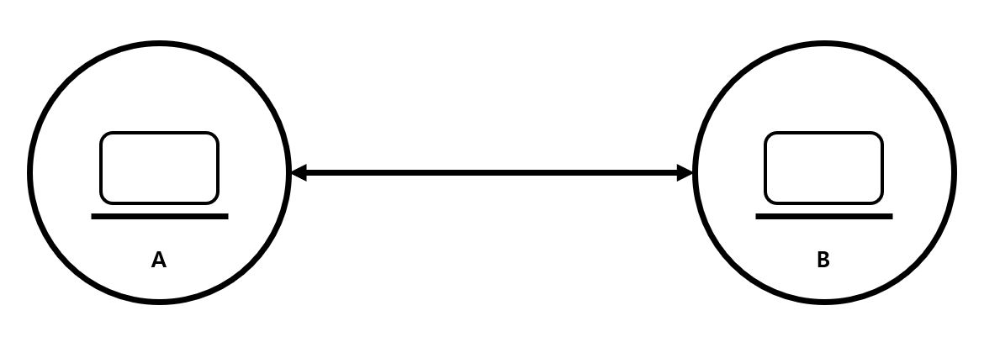
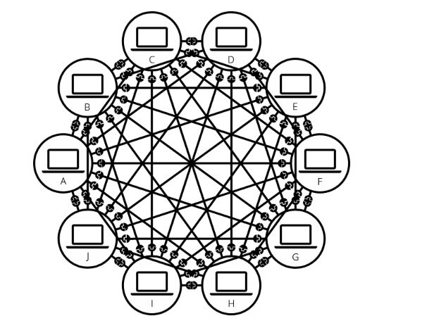
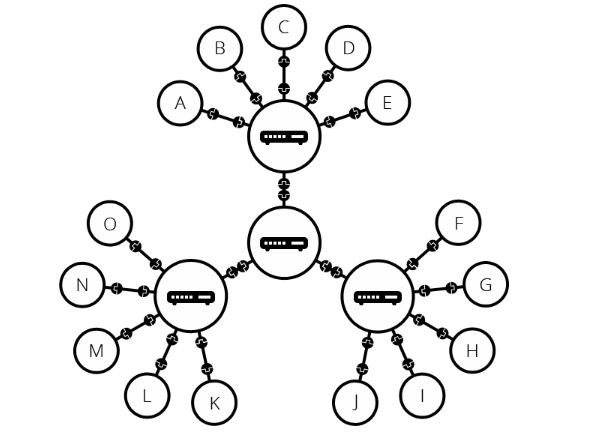
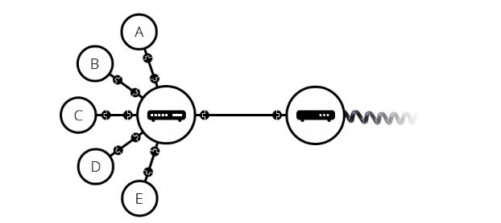

# 인터넷은 어떻게 동작하는가?

## 인터넷이란?

인터넷이란 웹의 핵심적인 기술로, 전 세계적으로 수 천만개 이상의 컴퓨터들이 서로 연결하여 **TCP/IP**라는 통신 프로토콜을 이용해 정보를 주고 받는 컴퓨터 네트워크이다.  
네트워크란 두 개 이상의 컴퓨터가 어떠한 통신 매체(이더넷 케이블, WiFi 등)을 통해 물리적, 무선으로 통신하는 것을 말한다.

---

## 인터넷의 시작

인터넷은 1960년 대 미육군에서 기금한 연구 프로젝트에서 시작되었다. 소련에서 처음으로 인공위성을 발사하는 데 성공하자 이에 위협을 느낀 미국은 새로운 기술을 연구하는 ARPA(Advanced Research Projects Agency), 고등 연구 계획국 부서를 창설하였고, ARPA는 1969년 현재 웹의 모태가 되는 ARPANET을 개발하였다. ARPANET은 핵과 같은 공격에 대비하여 전체 통신 시스템에서 데이터를 안전하게 보관 및 전송할 수 있는 시스템이다.

초기에 ARPANET은 미국 국방성과 대학교를 연결하였다. 1983년 ARPANET은 민간 연구용의 작은 네트워크과 군사용 MILNETMilitary Network로 나누어졌고, 여기서 민간 연구용의 ARPANET이 현재 전 세계의 모든 컴퓨터를 연결하고 있는 인터넷으로 발전하였다.

인터넷을 지원하는 다양한 기술은 시간이 지남에 따라 진화해왔지만 작동 방식은 그다지 변하지 않았다.

## 인터넷의 어원

인터넷이란 이름은 1973년 TCP/IP를 정립한 빈튼 서프(Vinton Gray Cerf)와 로버트 칸(Robert E. Kahn)이 '네트워크의 네트워크'를 구현하여 모든 컴퓨터를 하나의 통신망 안에 연결(International Network)하고자 하는 의도에서 이를 줄여 인터넷이라고 처음 명명하였던 것에 어원을 두고 있다.

## 1. 단순한 네트워크

위에서 언급했듯이 네트워크는 두 개 이상의 컴퓨터가 통신 매체를 통해 통신하는 것이다.

### (1) 1:1 연결

두 개의 컴퓨터가 서로 통신을 할 때, 우리는 다른 컴퓨터와 물리적으로 (보통 이더넷 케이블) 또는 무선(WiFi, Bluetooth)으로 연결되어야 한다. 모든 현대 컴퓨터들은 이러한 연결 방법 중 하나를 이용하여 연결한다.

> 이 글의 나머지 부분에서는 유선 케이블에 대해서만 이야기 하지만 무선 네트워크도 동일한 방식이다.

두 대의 컴퓨터를 연결한다고 가정했을 때, 아래와 같이 단순한 구조이다.

  

### (2) 多:多 연결

1:1로 연결하는 방식과 같은 방식으로 원하는 만큼 컴퓨터를 연결할 수 있다. 그러나 이렇게 연결할 경우엔 치명적인 약점이 있다. 컴퓨터의 수가 늘어날수록 형태가 매우 복잡해진다. 예로 1:1로 연결하는 방식으로 10대의 컴퓨터를 연결한다고 생각해보자.

  

이 경우 컴퓨터 당 9개의 플러그가 달린 45개의 케이블이 필요하다.

### (3) 라우터 연결

위 문제를 해결하기 위해 네트워크의 각 컴퓨터를 "라우터(Router)"라고 하는 특수한 소형 컴퓨터에 연결한다. 이 라우터의 목적은 컴퓨터 간의 통신을 목적지로 잘 전달해주는 '경로' 역할이다. 올바른 전송지와 수신지로 데이터가 갈 수 있도록 도움을 주는 핵심적인 역할이다. 아래 라우터를 이용한 네트워크 구조를 살펴보자.

  

이 라우터를 시스템에 추가하면 10대의 컴퓨터 네트워크에는 10개의 케이블만 필요하게 된다. 각 컴퓨터는 단일 플러그와 10개의 플러그가 있는 하나의 라우터만이 필요하게 된다.

## 2. 네트워크 속의 네트워크

라우터를 이용하니 수십 대의 컴퓨터를 연결하는 것이 수월해졌다. 그러나 네트워크가 복잡해지고 확장됨에 따라 수백, 수천, 수십억 대의 컴퓨터를 연결해야 되는 상황이 오게 된다면 어떻게 해야할까?

그에 대한 솔루션은 라우터를 한개만 사용하는 것이 아닌 두 대 이상의 라우터를 연결하는 것이었다.

라우터는 '경로'의 역할 뿐만 아니라 통신도 할 수 있는 장치이다.

  

즉, 여러 컴퓨터를 라우터에 연결하고 라우터와 라우터 간을 연결함으로서 우리는 네트워크를 무한히(IPv4가 지원하는 주소 크기만큼) 확장할 수 있게 되었다.

  

이러한 네트워크가 모이게 되면서 어느정도 규모가 있는 네트워크가 형성되었다.
하지만 우리는 간과한 것이 있다. 그것은 '거리'이다. 네트워크를 사용하는 사용자들은 각자 다른 도시, 나라에 위치해 있을 수 있다. 따라서 이 거리 간의 발생하는 각종 왜곡, 잡음 등을 보장해줄 수 있는 장치가 필요했다.

이에 대한 솔루션으로 '모뎀'이 생기게되었다.

> 모뎀은 우리 네트워크의 정보를 전화 시설에서 처리할 수 있는 정보로 바꾸며, 그 반대의 경우도 마찬가지이다.

  

모뎀은 먼 거리에서도 네트워크 간 연결이 가능하도록 통신 데이터를 전화로 구축되어 있는 시설에서 처리할 수 있는 정보로 바꿔주는 역할을 한다.

그렇다면 이 라우터를 누가 관리를 하는가?

그것은 바로 인터넷 서비스 제공 업체(ISP, Internet Service Provider)이다.

> ISP는 모두 함께 연결되는 몇몇 특수한 라우터를 관리하고 다른 ISP의 라우터에도 액세스할 수 있는 회사이다. 우리나라에는 SK텔레콤, KT, LG유플러스 등이 있다.

따라서 우리 네트워크의 메시지는 ISP 네트워크의 네트워크를 통해 대상 네트워크로 전달된다. 인터넷은 아래 그림과 같이 이러한 전체 네트워크 인프라로 구성된다.

  

