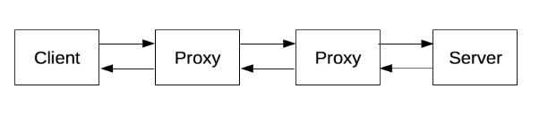
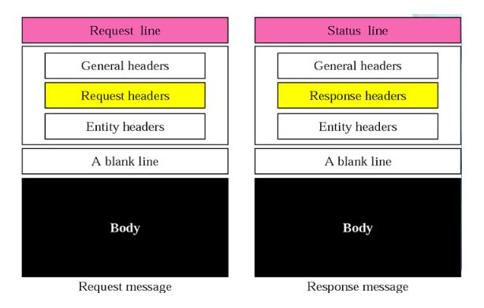
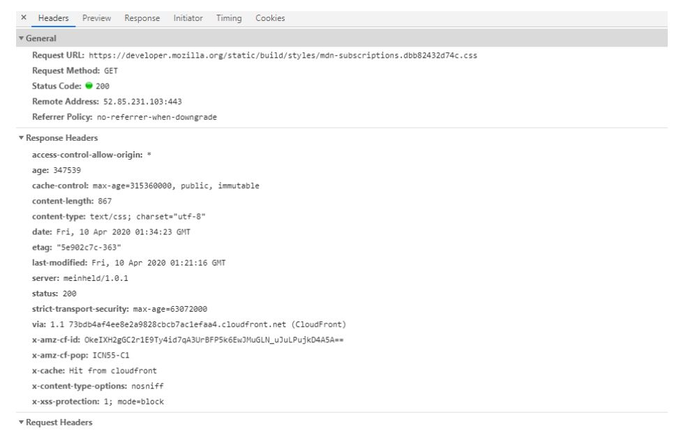
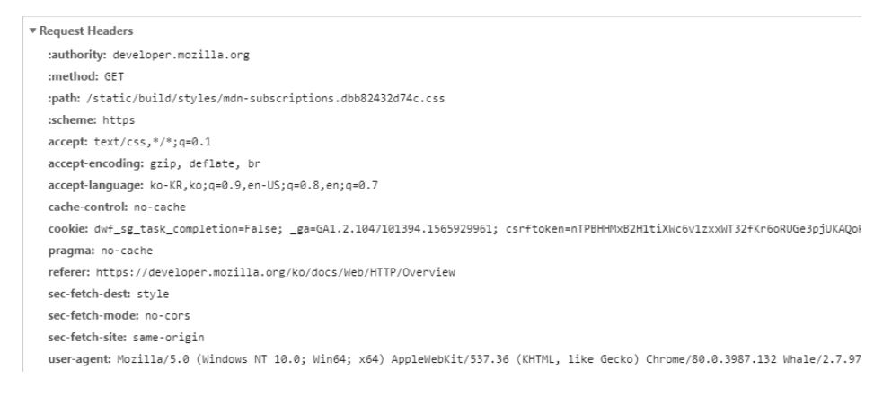

# HTTP란?

HTTP(Hyper Text Transfer Protocol) 약자로 인터넷에서 데이터를 주고 받을 수 있게 해주는 프로토콜로, 하이퍼 텍스트 전송 프로토콜이라고 한다.

- HTTP는 서버와 클라이언트가 서로 데이터를 주고받기 위해 사용되는 통신 규약, 쉽게 말해 규칙이다.
- 1989년 팀 버너스 리(Tim Berners Lee)가 처음 설계 했으며, 초기 단계에서 발전을 거듭해 현재는 HTML 문서와 같은 정보들을 가져오는데 사용된다.
- TCP/IP(Transmission Control Protocol / Internet Protocol)을 이용하며, 사용 포트 번호는 기본적으로 80이다.
- 인터넷 기반 서비스에는 HTTP 외에도 Email, FTP, DNS, NEWS 등이 있다.

인터넷 주소를 지정할 때 "http://www.~"와 같이 시작하는 것은 www.~이라는 인터넷 주소가 가진 데이터 정보 등의 교환을 http의 통신 규약대로 처리하는 것을 의미한다. 또 HTTP는 애플리케이션 계층의 최상위에 있기 때문에, 기본 레이어들은 HTTP의 명세와는 관련이 없다.

클라이언트 ---메세지---> 서버 를 요청(request)이라고 하며,
서버 ---메세지---> 클라이언트 를 응답(responses)라고 부른다.

클라이언트(사용자) : 사용자를 대신하여 동작하는 모든 도구를 말한다. 브라우저는 (항상) 클라이언트의 역할을 한다. 브라우저는 절대로 서버가 될 수 없다.

웹 페이지를 예로 들면,  
브라우저는 페이지에 나타날 HTML 문서를 요청한다. >> 스크립트/이미지/비디오/CSS 등등을 가져온다. >> 이 리소스들을 혼합해 웹페이지에 표시한다.

서버(웹서버): 통신 채널 반대편에는 클라이언트의 요청을 받아 이 요청에 대한 정보를 제공하는 서버가 존재한다. 요청에 대한 답을 HTTP 메시지(HTTP message)라고 한다.

HTTP는 클라이언트-서버가 메시지를 주고 받으면 연결을 끊어버린다. 이 특징을 보완하기 위해 Cookie와 같은 기술이 등장했다. (무상태, Stateless)
또 이 요청과 응답 사이에는 여러 개체들이 있는데, 그 중 프록시는 게이트웨이 또는 캐시 역할을 한다.

  

프록시 : 웹브라우저와 서버 사이에 수많은 HTTP 메시지들이 왔다갔다 하는데, 이들은 어떻게 동작하는지 눈에 보이지 않는다. 애플리케이션 계층에서 동작하는 것들을 일반적으로 프록시라고 말한다. 프록시는 눈에 보이거나 그렇지 않을 수도 있으며 다양한 기능들을 수행한다.

- 캐싱 (HTTP로 문서 캐시되는 방식 제어 기능)
- 필터링 (바이러스 백신 스캔, 유해 컨텐츠 차단 기능)
- 로드 밸런싱 (여러 서버들이 서로 다른 요청을 처리하도록 허용)
- 인증 (다양한 리소스에 대한 접근 제어, HTTP-WWW-Authenticate 또는 HTTP 쿠키를 사용해 설정 가능)
- 로깅 (이력 정보를 저장)

  

HTTP 메시지는 요청 메시지(Request message)와 응답 메시지(Response message)로 분류된다.

  

General은 메시지에 대한 일반적인 정보를 제공한다. (요청/응답 전체에 적용)

- Request Method : 클라이언트가 수행하고자 하는 동작 정의 (GET, POST, PUT, DELETE, OPTIONS, HEAD). 일반적으로 GET(클라이언트가 리소스를 가져옴)이나 POST(HTML 폼의 데이터를 전송)를 사용한다.
- Status Code : 200 정상

Response Headers는 reponse message만 취급.

- date: 메시지 작성 일자
- cache-control : 캐시 사용 제어. (no-cache: 캐시를 쌓지 않는다 / max-age=seconds:seconds 값보다 오래된 응답은 보내지 않는다 / public : 어떤 캐시든 쌓는다.)
- content-type : 응답되는 컨텐츠의 유형
- content-length : 응답되는 컨텐츠의 길이
- last-modified : 응답되는 컨텐츠가 마지막으로 수정된 일시
- server: HTTP server의 정보

  

Request Headers는 request message만 취급.

- authority: 도메인 이름 및 옵션 포트로 이뤄진 URL. (옵션 포트 앞에는 ':'가 붙는다.)
- accept-language : 클라이언트가 요청하는 언어
- user-agent : 클라이언트 프로그램(웹브라우저)을 표시함
