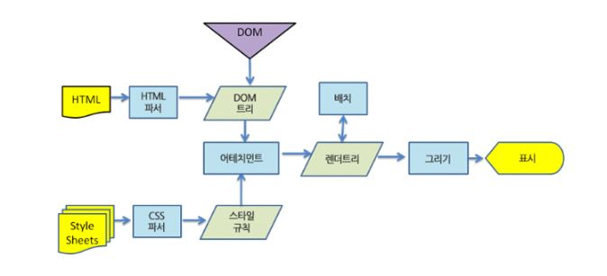
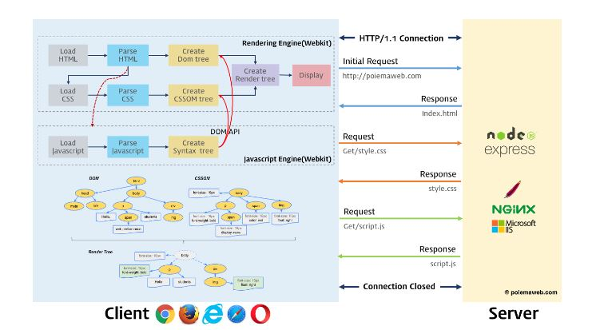

# 웹 브라우저는 어떻게 동작하는가?

## 브라우저란?

웹 브라우저는 동기적(Synchronous)으로 (HTML + CSS), JavaScript 언어를 해석하여 내용을 화면에 보여주는 응용 소프트웨어이다.

웹 브라우저가 웹 서버에 필요한 자원(웹 페이지)을 요청하면 서버는 응답하고 웹 브라우저는 이를 해석한 후 사용자(Client)에게 보여준다. 보통 자원은 HTML 문서지만 PDF, 이미지 등 다양한 형태일 수 있다.

웹 브라우저의 종류는 다양하다. 크롬, 네이버 웨일, 파이어폭스, 사파리 등이 대표적인 예이다.

이 글에서는 크롬 브라우저를 기반으로 설명해본다.

---

## 브라우저 기본 구조

  

1. 사용자 인터페이스 
   사용자가 접근할 수 있는 영역이다. URL(Uniform Resource Identifier)을 입력할 수 있는 주소 표시줄, 이전/다음 버튼, 북마크 메뉴, 새로 고침 버튼과 현재 문서의 로드를 중단할 수 있는 정지 버튼, 홈 버튼 등 요청한 페이지를 보여주는 창을 제외한 나머지 모든 부분

2. 브라우저 엔진 
   사용자 인터페이스와 렌더링 엔진 사이의 동작을 제어한다. Data Storage를 참조하여 로컬에 데이터를 쓰고 읽으면서 다양한 작업을 한다.

3. 렌더링 엔진  
   웹 서버로부터 응답 받은 자원을 웹 브라우저 상에 나타낸다. 예를 들어 HTML 문서를 응답 받으면 HTML과 CSS를 파싱하여 화면에 표시한다.  
   브라우저의 동작 원리를 이해하려면 렌더링 엔진의 이해가 중요하다. 브라우저는 서버로부터 HTML 문서를 응답 받으면 렌더링 엔진의 HTML 파서와 CSS 파서에 의해 파싱(parsing) 되어 DOM, CSSOM 트리로 변환되고 렌더 트리로 결합한다.
   이렇게 생성된 렌더 트리를 기반으로 브라우저는 웹 페이지를 나타낸다.

> 사용자가 입력한 HTML 문서를 서버에 보내고 서버에서 브라우저로 HTML 문서를 보내게 된다. 그럼 서버로부터 HTML 문서를 응답 받은 브라우저는 렌더링 엔진을 통해서 HTML 파서와 CSS 파서에 의해 파싱이 된다. 그 파싱 된 것이 DOM, CSSOM 트리로 변환이 되고 렌더 트리에 결합이 된다. 이렇게 생성된 렌더 트리를 기반으로 브라우저는 웹 페이지 즉, 화면 상에 나타내게 된다.

4. 통신  
   HTTP 요청과 같은, 그런 서버와 통신이 가능하게 하는 네트워크 호출에 사용된다.

5. 자바스크립트 해석기  
   자바스크립트 코드를 해석하고 실행한다.

6. UI 백엔드  
   select, input 등 기본적인 위젯을 그리는 인터페이스

7. 자료 저장소 
   Cookie, Local Storage, Indexed DB 등 브라우저 메모리를 활용하여 저장하는 영역

## 렌더링 엔진이란?

렌더링 엔진이란 HTML, XML, 이미지 등 요청받은 내용을 브라우저 화면에 표시하는 엔진

#### 렌더링 엔진의 종류

- Blink - 크롬, 오페라
- Webkit - 사파리
- Trident - 익스플로어
- EdgeHTML - 마이크로소프트 엣지

렌더링 엔진은 사용자의 좀 더 나은 경험을 위해서, 가능하면 빠르게 내용을 표시하기 위해 일련의 과정들이 동기적으로 진행되지 않는다. HTML을 파싱 할 때까지 기다리지 않고 렌더 트리 배치와 그리기 과정을 시작한다.

Webkit 엔진으로 동작 과정의 순서를 살펴보자.

  

동작 과정의 순서는 위에서 설명한 기본 동작 과정과 유사하다.

> HTML, CSS 문서가 파서에 의해 DOM, CSSOM 트리로 변환되고 어테치먼트를 통해 렌더트리에 결합된다. 렌더 트리는 배치를 시작하며 그리기 시작하고 화면상에 표시된다.

### 웹 브라우저 렌더링 과정 Critical Rendering Path, CRP 과정

1. (HTML의 역할) DOM 트리 구축을 위한 HTML 파싱
2. (CSS의 역할)렌더 트리 구축
3. (DOM+CSSOM)렌더 트리 배치, 스타일 계산
4. (Layout, Reflow) 레이아웃 실행, Layer Tree 업데이트
5. (Paint/Composite)렌더 트리 그리기

#### 1. DOM 트리 구축 위한 HTML 파싱

> 파싱 : 파싱은 어휘 분석/구문 분석으로 구분. 어휘 분석은 자료를 토큰으로 분해하는 과정, 토큰은 유효하게 구성된 단위의 집합체로, 인간의 언어로 예를 들면 사전에 등장하는 모든 단어에 해당한다. 구문 분석은 언어의 구문 규칙을 적용하는 과정이다.

#### DOM 트리 생성 과정

1. 변환 : 브라우저가 원시바이트(Bytes)를 디스크나 네트워크에서 읽어와 해당 파일에 지정된 인코딩(UTF-8)에 따라 개별 문자로 변환한다.
2. 토큰화 : 브라우저가 문자열을 W3C 표준에 지정된 고유 토큰 (태그 형태의 문자)으로 변환한다. 토큰은 특별한 의미와 고유의 규칙을 갖는다.
3. 렉싱(Tokens > Nodes): 방출된 토큰은 속성 및 규칙을 정의하는 객체로 변환된다.
4. DOM 생성 : HTML 마크업이 여러 태그간의 관계를 정의하면서 트리 구조를 형성한다.

#### 2. (CSS의 역할)렌더 트리 구축

DOM트리 생성 과정과 동일하며, DOM 트리가 구축되는 동안 CSS에 의해 렌더 트리를 구축한다. 올바른 순서대로 문서의 구성요소를 그려낼 수 있도록 한다. (시각적 속성을 다룬다)

DOM 요소에 부합하나 1:1로 대응하지는 않는다 (ex. head와 같은 비시각적 요소, select요소 따위의 복잡성, position-float같은 다른 위치의 요소들)

#### 3. (DOM+CSSOM)렌더 트리 배치, 스타일 계산

컨텐츠의 DOM, 스타일의 CSSOM이 만나 객체를 화면에 픽셀로 찍어내는 과정이 필요하다. 이들이 합쳐져 Render Tree가 만들어진다. 필요에 따라 1개 이상의 Layer가 만들어진다.

#### 4. (Layout 또는 Reflow) 레이아웃 실행, Layer Tree 업데이트

앞에서 노드와 노드의 스타일만 입혀졌다면, Layout에서는 화면에 그려질 노드의 정확한 위치와 크기를 계산한다. 이로써 노드는 자신의 정확한 위치를 알 수 있다.

#### 5. (Paint/Composite)렌더 트리 그리기

Layout에서 노드의 화면 구상이 다 이뤄지면, Paint 이벤트를 통해 노드들은 화면에 픽셀로 변환한다. 텍스트, 색, 이미지 등 모든 시각적인 요소들이 입혀진다. 이를 Painting 또는 Rasterizing 이라고 하며, Layer가 여러개인 경우 이를 합성해 하나의 bitmap을 만드는 작업은 compositing이라고 한다.

## 그렇다면 자바스크립트는?

지금까지 설명으론 HTML 문서를 파싱하여 HTML과 CSS를 렌더링 엔진에서 처리하는 과정을 알아봤다.

자바스크립트는 자바스크립트 엔진이 처리한다. HTML 파서는 < script >태그를 만나면 JavaScript 코드를 실행하기 위해 DOM 생성 프로세스를 중지하고 자바스크립트 엔진으로 권한을 넘긴다. 제어 권한을 넘겨받은 자바스크립트 엔진은 < script > 태그 내의 JavaScript 코드 또는 src 속성에 정의된 JavaScript 파일을 로드하고 파싱하여 실행한다. JavaScript의 실행이 완료되면 다시 HTML 파서로 제어 권한을 넘겨서 중지했던 시점으로 돌아가 DOM 생성을 재개한다.

 

  

이처럼 브라우저는 동기적으로 HTML, CSS, JavaScript를 처리한다.

자바스크립트 엔진에 제어 권한이 있을 때 JavaScript 코드가 완성되지 않은 DOM을 조작하게 된다면 어떻게 될까?

당연하게도 에러가 발생한다.

이것이 HTML 파일에서 JavaScript 코드를 < body >태그 하단에 위치 시키는 이유이다.
