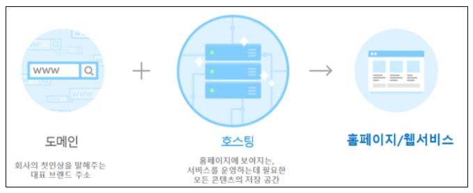

# 호스팅이란?

호스팅이란 서버의 전체 혹은 일부를 임대해주는 서비스를 뜻한다. 다양한 사용자(클라이언트)들이 있기 때문에 이용 시간이 다양한 만큼 보통 서버는 24시간 내내 켜져있는 경우가 대다수이다. 그런데 이 '서버'라는 것을 관리하기 위해서는 24시간 내내 안정적으로 전기를 공급해야 하고 빠르고 안정적인 인터넷 회선을 사용해야 하고, 물리적으로나 논리적으로나 철저하게 보안 시스템을 갖추고 있어야한다.

보기만 해도 쉽지 않다는 것을 알 수 있다. 따라서 개인이나 중소기업이 서버를 관리하기 보다 전문 업체의 호스팅 서비스를 사용하는 것이 일반적이다.

  

## 호스팅의 종류

크게 3가지로 '웹 호스팅', '서버 호스팅', '클라우드 서버' 정도로 나눌 수 있다.

1. 웹 호스팅  
   하나의서버로 여러 도메인을 나누어 사용하는 개념이다. 나누어 사용하는 만큼 저렴하게 이용할 수 있고, 호스팅 업체의 통합 관리를 받기 때문에 관리도 용이하다. 그러나 사용할 수 있는 하드웨어가 제한적이라는 치명적인 단점이 있다.

2. 서버 호스팅  
   서버 호스팅은 고객이 단독 서버를 임대하는 형태이다. 넓은 하드웨어 공간을 사용할 수 있기 때문에 서버 운영/관리에 대한 직접적인 권한을 가질 수 있다. 더불어, 다른 기업들과 나눠 하나의 서버를 나눠 사용하는 웹 호스팅에 비해 데이터 전송 속도가 우수하다. 그러나, 단독으로 사용하는만큼 비용도 높은 편이다. 주로 대규모 데이터를 다뤄야하는 기업들이 사용하기 좋다.

3) 클라우드 서버  
   사실 클라우드 서버는 호스팅 하나로 묶기엔 너무 광범위 해졌으나, IaaS를 기준으로 살펴보자. IaaS란 쉽게 말해 인프라를 대여해주는 클라우드 서비스를 말한다. 즉, 서버 호스팅을 대여해주는 서비스이다. 차별점이 무엇이냐면 '가상화'한 것에 있다. 클라우드 서버는 가상 서버를 단독으로 사용할 수 있는 형태로 이루어져있다. 유동성 있게 서버의 자원을 늘리고 축소할 수 있는 점에서 서버 관리의 유연성을 증가해준다고 평가 받고 있으며, 실제로 많이 사용되는 서비스이다. (사용한만큼 금액을 지불하기 때문에 금전적인 면에서도 관리하기 쉽다.) 그러나, 클라우드 서비스를 제공하는 물리적인 서버의 오류가 생기면 연결되어 있는 모든 가상 서버에 문제가 생길 수 있다는 단점이 있다.
