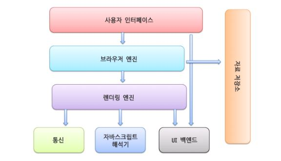

# 웹 브라우저는 어떻게 동작하는가?

## 브라우저란?

웹 브라우저는 동기적(Synchronous)으로 (HTML + CSS), JavaScript 언어를 해석하여 내용을 화면에 보여주는 응용 소프트웨어이다.

웹 브라우저가 웹 서버에 필요한 자원(웹 페이지)을 요청하면 서버는 응답하고 웹 브라우저는 이를 해석한 후 사용자(Client)에게 보여준다. 보통 자원은 HTML 문서지만 PDF, 이미지 등 다양한 형태일 수 있다.

웹 브라우저의 종류는 다양하다. 크롬, 네이버 웨일, 파이어폭스, 사파리 등이 대표적인 예이다.

이 글에서는 크롬 브라우저를 기반으로 설명해본다.

---

## 브라우저 기본 구조

  

1. 사용자 인터페이스 
   사용자가 접근할 수 있는 영역이다. URL(Uniform Resource Identifier)을 입력할 수 있는 주소 표시줄, 이전/다음 버튼, 북마크 메뉴, 새로 고침 버튼과 현재 문서의 로드를 중단할 수 있는 정지 버튼, 홈 버튼 등 요청한 페이지를 보여주는 창을 제외한 나머지 모든 부분

2. 브라우저 엔진 
   사용자 인터페이스와 렌더링 엔진 사이의 동작을 제어한다. Data Storage를 참조하여 로컬에 데이터를 쓰고 읽으면서 다양한 작업을 한다.

3. 렌더링 엔진  
   웹 서버로부터 응답 받은 자원을 웹 브라우저 상에 나타낸다. 예를 들어 HTML 문서를 응답 받으면 HTML과 CSS를 파싱하여 화면에 표시한다.  
   브라우저의 동작 원리를 이해하려면 렌더링 엔진의 이해가 중요하다. 브라우저는 서버로부터 HTML 문서를 응답 받으면 렌더링 엔진의 HTML 파서와 CSS 파서에 의해 파싱(parsing) 되어 DOM, CSSOM 트리로 변환되고 렌더 트리로 결합한다.
   이렇게 생성된 렌더 트리를 기반으로 브라우저는 웹 페이지를 나타낸다.

> 사용자가 입력한 HTML 문서를 서버에 보내고 서버에서 브라우저로 HTML 문서를 보내게 된다. 그럼 서버로부터 HTML 문서를 응답 받은 브라우저는 렌더링 엔진을 통해서 HTML 파서와 CSS 파서에 의해 파싱이 된다. 그 파싱 된 것이 DOM, CSSOM 트리로 변환이 되고 렌더 트리에 결합이 된다. 이렇게 생성된 렌더 트리를 기반으로 브라우저는 웹 페이지 즉, 화면 상에 나타내게 된다.

4. 통신  
   HTTP 요청과 같은, 그런 서버와 통신이 가능하게 하는 네트워크 호출에 사용된다.

5. UI 백엔드
