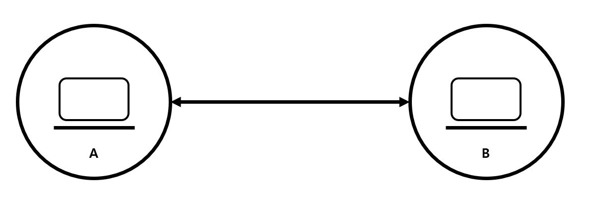
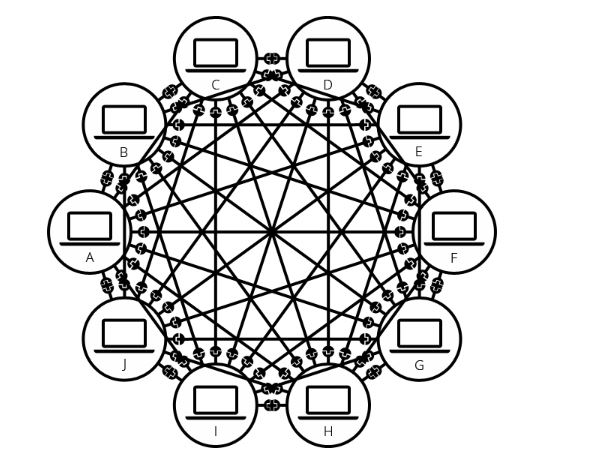
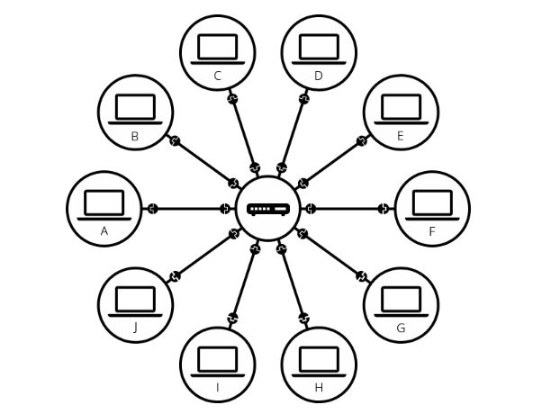
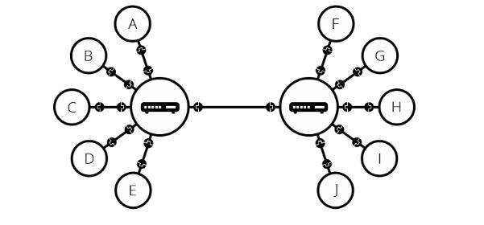
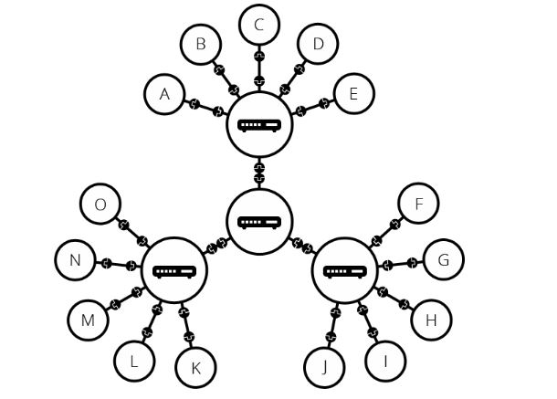
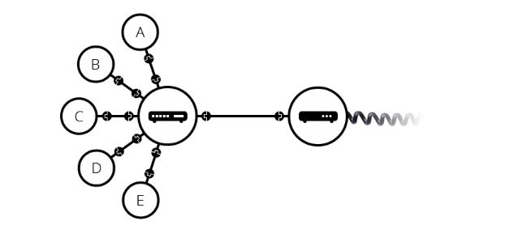
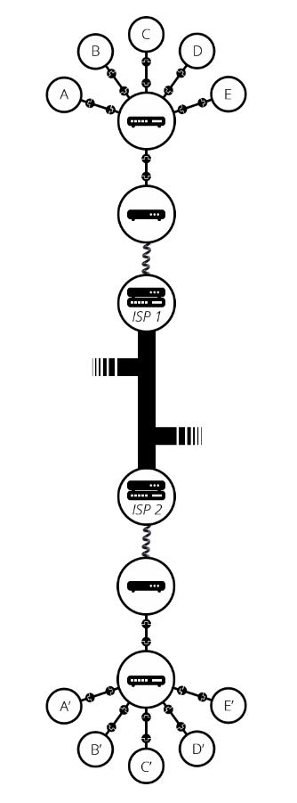

# 요약

- 인터넷(Internet)은 웹의 핵심적인 기술이다.
- 인터넷은 컴퓨터를 서로 연결하여 TCP/IP라는 통신 프로토콜을 이용해 정보를 주고받는 컴퓨터 네트워크이다.
- 인터넷 변화 양상
  - 컴퓨터 <-> 컴퓨터
    - 컴퓨터 <-> 라우터 <-> 컴퓨터
    - 컴퓨터 <-> 라우터 <-> 라우터 <-> 컴퓨터
    - 컴퓨터 <-> 라우터 <-> 모뎀 <-> 전화 시설 ~
    - 컴퓨터 <-> 라우터 <-> 모뎀 <-> 전화 시설 <-> ISP (<-> ISP) <-> 전화 시설 <-> 모뎀 <-> 라우터 <-> 컴퓨터

## 인터넷의 시작

인터넷은 1960년 대 미육군에서 기금한 연구 프로젝트에서 시작되었다. 소련에서 처음으로 인공위성을 발사하는 데 성공하자 이에 위협을 느낀 미국은 새로운 기술을 연구하는 ARPA(Advanced Research Projects Agency), 고등 연구 계획국 부서를 창설하였고, ARPA는 1969년 현재 웹의 모태가 되는 ARPANET을 개발하였다. ARPANET은 핵과 같은 공격에 대비하여 전체 통신 시스템에서 데이터를 안전하게 보관 및 전송할 수 있는 시스템이다.

초기에 ARPANET은 미국 국방성과 대학교를 연결하였다. 1983년 ARPANET은 민간 연구용의 작은 네트워크과 군사용 MILNETMilitary Network로 나누어졌고, 여기서 민간 연구용의 ARPANET이 현재 전 세계의 모든 컴퓨터를 연결하고 있는 인터넷으로 발전하였다.

인터넷을 지원하는 다양한 기술은 시간이 지남에 따라 진화해왔지만 작동 방식은 그다지 변하지 않았다.

## 인터넷의 어원

인터넷이란 이름은 1973년 TCP/IP를 정립한 빈튼 서프(Vinton Gray Cerf)와 로버트 칸(Robert E. Kahn)이 '네트워크의 네트워크'를 구현하여 모든 컴퓨터를 하나의 통신망 안에 연결(International Network)하고자 하는 의도에서 이를 줄여 인터넷이라고 처음 명명하였던 것에 어원을 두고 있다.

## 1. 단순한 네트워크

### (1) 1:1 연결

두 개의 컴퓨터가 서로 통신을 할 때, 우리는 다른 컴퓨터와 물리적으로 (보통 이더넷 케이블) 또는 무선(WiFi, Bluetooth)으로 연결되어야 한다. 모든 현대 컴퓨터들은 이러한 연결 방법 중 하나를 이용하여 연결을 지속할 수 있다.

> 이 글의 나머지 부분에서는 유선 케이블에 대해서만 이야기 하지만 무선 네트워크도 동일한 방식이다.

두 대의 컴퓨터를 연결한다고 가정했을 때, 아래와 같은 모양일 것이다.

  

### (2) 多:多 연결

1:1로 연결하는 방식과 같은 방식으로 원하는 만큼 컴퓨터를 연결할 수 있다. 하지만 이렇게 연결할 경우 컴퓨터의 수가 늘어날수록 매우 복잡해진다. 1:1로 연결하는 방식으로 10대의 컴퓨터를 연결한다고 생각해보자.

  

이 경우 컴퓨터 당 9개의 플러그가 달린 45개의 케이블이 필요하다.

### (3) 라우터 연결

위 문제를 해결하기 위해 네트워크의 각 컴퓨터를 "라우터(Router)"라고 하는 특수한 소형 컴퓨터에 연결한다. 이 라우터는 단 하나의 작업만 할 수 있다. 철도역의 신호원처럼 주어진 컴퓨터에서 보낸 메시지가 올바른 대상 컴퓨터에 도착하는지 확인한다. 컴퓨터 B에게 메시지를 보내려면 컴퓨터 A가 메시지를 라우터로 보내야하며, 라우터는 메시지를 컴퓨터 B로 전달하고 메시지가 컴퓨터 C로 전달되지 않도록해야한다.

  

이 라우터를 시스템에 추가하면 10대의 컴퓨터 네트워크에는 10개의 케이블만 필요하게 된다. 각 컴퓨터는 단일 플러그와 10개의 플러그가 있는 하나의 라우터만이 필요하게 된다.

## 2. 네트워크 속의 네트워크

그렇다면 수백, 수천, 수십억 대의 컴퓨터를 연결하려면 라우터에 그 만큼의 플러그가 필요하고 모든 컴퓨터가 연결되어야 할까?

라우터 자체로도 그 정도까지 확장이 불가능하다. 그렇다면 어떻게 해야할까?

앞서 라우터 또한 '컴퓨터'라고 했었다. 따라서 두 대 이상의 라우터도 연결할 수 있다. 아래 그림은 각각의 라우터로 연결된 두 개의 네트워크를 연결한 모습이다.

  

즉, 컴퓨터를 라우터에 연결하고, 라우터에서 라우터로 연결함으로서 연결을 무한히 확장할 수 있다.

  

이러한 네트워크는 우리가 인터넷이라고 부르는 것에 매우 가까워졌다. 상대적으로 많은 컴퓨터를 적은 케이블로 연결할 수 있게 되었다. 하지만 아직까지 우리에게는 물리적 한계가 존재한다. 예를 들어 수십만 km 정도의 먼 거리를 유선 케이블로는 연결할 수는 없을 것이다.

그렇다면 이 문제를 어떻게 해결할 수 있을까?

우리는 이미 모든 집집마다 연결된 케이블이 있다. 바로 '전화선'이다.
우리의 네트워크와 전화 시설을 연결하기 위해선, '모뎀(MODEM, MOdulator and DEModulator)"이라는 특수 장비가 필요하다.

> 모뎀은 우리 네트워크의 정보를 전화 시설에서 처리할 수 있는 정보로 바꾸며, 그 반대의 경우도 마찬가지이다.

  

모뎀을 통해 우리의 네트워크는 전화 시설에 연결된다. 하지만, 아직까지 우리의 컴퓨터가 보낸 메시지가 도달해야 할 컴퓨터(혹은 네트워크)까지 도달하지 않은 상태이다. 이 메시지가 전달되려면 인터넷 서비스 제공 업체(ISP, Internet Service Provider)에 연결되어야 한다.

> ISP는 모두 함께 연결되는 몇몇 특수한 라우터를 관리하고 다른 ISP의 라우터에도 액세스할 수 있는 회사이다. 우리나라에는 SK텔레콤, KT, LG유플러스 등이 있다.

따라서 우리 네트워크의 메시지는 ISP 네트워크의 네트워크를 통해 대상 네트워크로 전달된다. 인터넷은 아래 그림과 같이 이러한 전체 네트워크 인프라로 구성된다.

  

